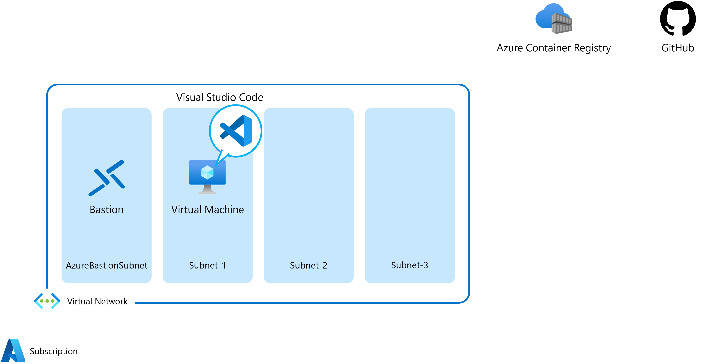
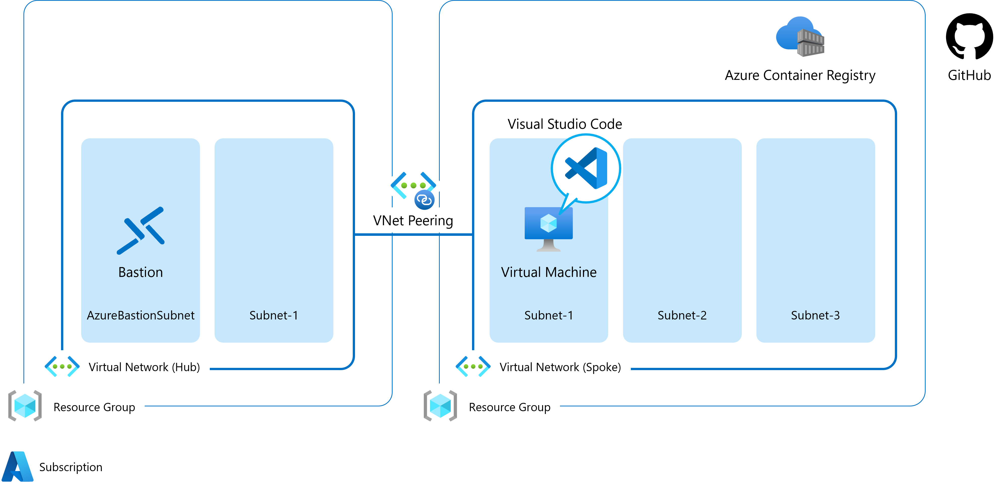

Azure PaaS CI/CD Hands-on lab  
Dec 2022

 

### 参考情報

- <a href="https://docs.microsoft.com/ja-jp/azure/cloud-adoption-framework/ready/azure-best-practices/resource-naming">名前付け規則を定義する</a>

- <a href="https://docs.microsoft.com/ja-jp/azure/cloud-adoption-framework/ready/azure-best-practices/resource-abbreviations">Azure リソースの種類に推奨される省略形</a>

 

## リソースの展開

 

### パラメーター

- **registryName**: Azure Container Registry（5 ～ 26 文字/英小文字、数字）

  参考: [ContainerApps: Not able to use Continous Deployment due to a invalid Secret Name error](https://github.com/microsoft/azure-container-apps/issues/495)

- **virtualNetwork**: 仮想ネットワーク名（2 ～ 64 文字/英数字、アンダースコア、ピリオド、およびハイフン）

- **addressPrefix**: IPv4 アドレス空間

- **subnet1**: サブネットの名前 (1)（1 ～ 80 文字/英数字、アンダースコア、ピリオド、およびハイフン）

- **subnet1Prefix**: サブネット アドレス範囲 (1)

- **subnet2**: サブネットの名前 (2)（1 ～ 80 文字/英数字、アンダースコア、ピリオド、およびハイフン）

- **subnet2Prefix**: サブネット アドレス範囲 (2)

- **subnet3**: サブネットの名前 (3)（1 ～ 80 文字/英数字、アンダースコア、ピリオド、およびハイフン）

- **subnet3Prefix**: サブネット アドレス範囲 (3)

- **bastionPrefix**: AzureBastionSubnet サブネットのアドレス範囲

- **networkSecurityGroup**: ネットワーク セキュリティ グループ名（2 ～ 64 文字/英数字、アンダースコア、ピリオド、およびハイフン）

- **bastionHost**: Bastion リソースの名前（1 ～ 80 文字/英数字、アンダースコア、ピリオド、およびハイフン）

※ 事前にリソース グループの作成が必要

※ 選択したリソース グループのリージョンにすべてのリソースを展開

 

### 展開後のリソース

 

## リソースの個別展開

 

### 仮想ネットワークの展開（HUB）

### パラメーター

- **virtualNetwork**: 仮想ネットワーク名（2 ～ 64 文字/英数字、アンダースコア、ピリオド、およびハイフン）

- **addressPrefix**: IPv4 アドレス空間

- **subnet1**: サブネットの名前 (1)（1 ～ 80 文字/英数字、アンダースコア、ピリオド、およびハイフン）

- **subnet1Prefix**: サブネット アドレス範囲 (1)

- **bastionPrefix**: AzureBastionSubnet サブネットのアドレス範囲

- **bastionHost**: Bastion リソースの名前（1 ～ 80 文字/英数字、アンダースコア、ピリオド、およびハイフン）

※ 事前にリソース グループの作成が必要

※ 選択したリソース グループのリージョンにすべてのリソースを展開

 

### 仮想ネットワーク（Spoke）＋ Azure Container Registry

### パラメーター

- **registryName**: Azure Container Registry（5 ～ 50 文字/英小文字、数字）

- **virtualNetwork**: 仮想ネットワーク名（2 ～ 64 文字/英数字、アンダースコア、ピリオド、およびハイフン）

- **addressPrefix**: IPv4 アドレス空間

- **subnet1**: サブネットの名前 (1)（1 ～ 80 文字/英数字、アンダースコア、ピリオド、およびハイフン）

- **subnet1Prefix**: サブネット アドレス範囲 (1)

- **subnet2**: サブネットの名前 (2)（1 ～ 80 文字/英数字、アンダースコア、ピリオド、およびハイフン）

- **subnet2Prefix**: サブネット アドレス範囲 (2)

- **subnet3**: サブネットの名前 (3)（1 ～ 80 文字/英数字、アンダースコア、ピリオド、およびハイフン）

- **subnet3Prefix**: サブネット アドレス範囲 (3)

- **networkSecurityGroup**: ネットワーク セキュリティ グループ名（2 ～ 64 文字/英数字、アンダースコア、ピリオド、およびハイフン）

※ 事前にリソース グループの作成が必要

※ 選択したリソース グループのリージョンにすべてのリソースを展開

### 展開後のリソース

※ 展開後に手動で VNet Peering を構成ください。

