Azure PaaS CI/CD Hands-on lab  
Dec 2022

<br />

## Contents

- [Self-Hosted Runner を使用したアプリケーションの展開](#appdendix-self-hosted-runner-を使用したアプリケーションの展開)

  - [Task 1: App Service の受信トラフィック制御](#task-1-app-service-の受信トラフィック制御)

  - [Task 2: Personal Access Token の作成](#task-2-personal-access-token-の作成)

  - [Task 3: シークレットの登録](#task-3-シークレットの登録)

  - [Task 4: Azure Container Instances への Self-Hosted Runner の展開](#task-4-azure-container-instances-への-self-hosted-runner-の展開)

  - [Task 5: ワークフローでの Self-Hosted Runner の利用](#task-5-ワークフローでの-self-hosted-runner-の利用)

<br/>

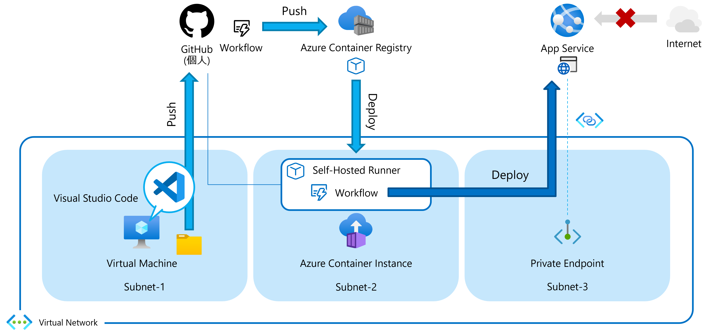

<br />

## Appdendix: Self-Hosted Runner を使用したアプリケーションの展開

### Task 1: App Service の受信トラフィック制御

- Azure ポータルへアクセスし App Service (ステージング環境) の管理ブレードへ移動

- "**ネットワーク**” を選択し "**プライベート エンドポイント**" をクリック

  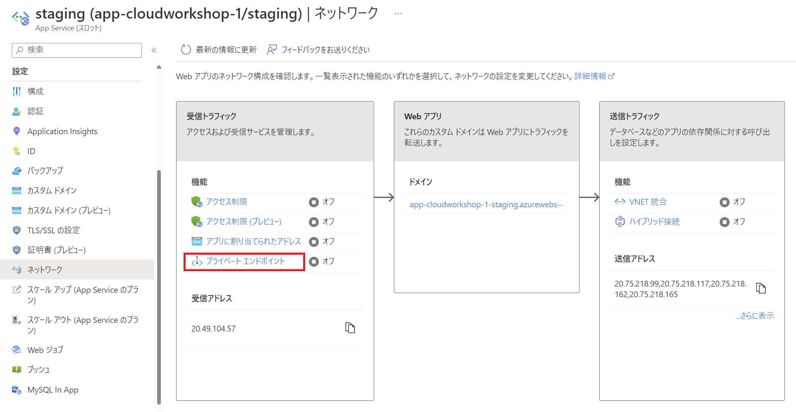

- "**＋ 追加**" をクリック

  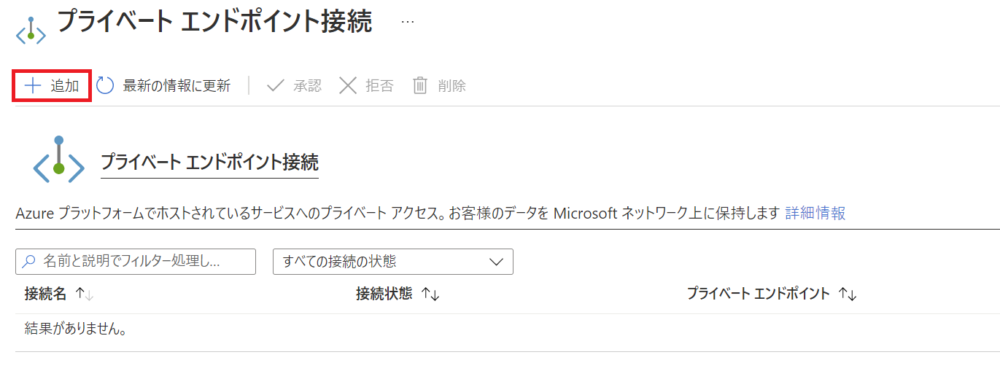

- 名前を入力し、サブスクリプション、仮想ネットワーク、サブネットを選択し "**OK**" をクリック

  - **名前**: pe-cloudworkshop-xx (xx は数字、任意の名前で OK)

  - **サブスクリプション**: ワークショップで使用中のサブスクリプション

  - **仮想ネットワーク**: vnet-1

  - **サブネット**: Subnet-3

  - **プライベート DNS ゾーンと統合する**: はい

    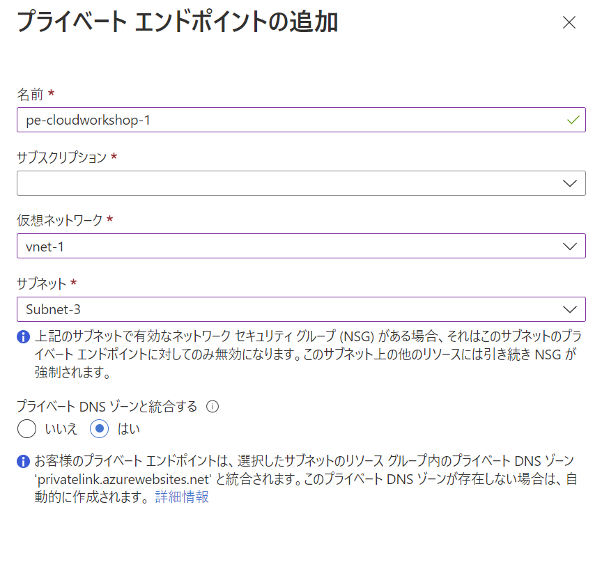

- プライベート エンドポイント作成後、"**概要**" の "**URL**" をクリック

  

- インターネットを介してアクセスできなくなったことを確認

  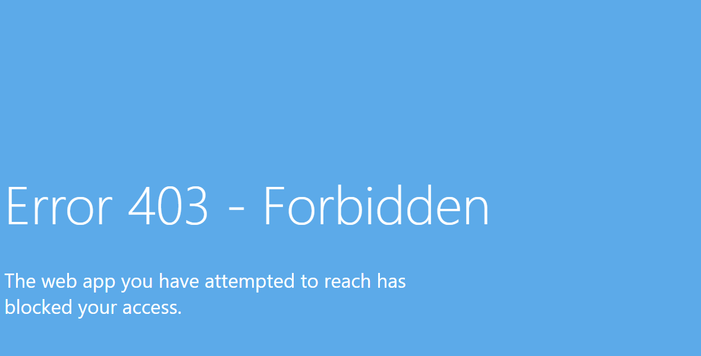

- GitHub リポジトリへアクセス

- App Service へアプリを展開するワークフローを実行

  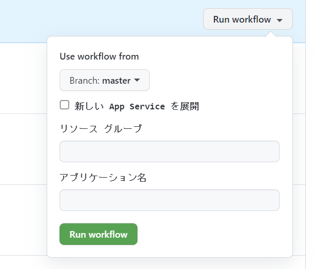

  ※ 新しいApp Service を展開はオフで実行

- ワークフローがエラーで終了することを確認

  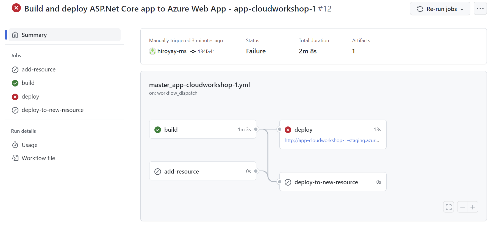

- deploy ジョブをクリックし、エラー内容を確認

  

<br />

### Task 2: Personal Access Token の作成

- GitHub アカウントの "**Settings**" を選択

- 左側メニューから "**Developer settings**" を選択

- "**Personal access tokens**" - "**Tokens (classic)**" を選択

- "**Generate new token**" - "**Generate new token (classic)**" をクリック

- トークンの説明、有効期間、権限スコープを設定

  - **Note**:: Setup environment (任意)

  - **Expiration**: 7 days (任意)

  - **Select scopes**: repo と admin:org の read:org にチェック

- "**Generate token** をクリックし、トークンを作成

- トークンの右にあるボタンをクリックしてコピー、一時的にメモ帳などに貼り付けて保存

<br />

### Task 3: シークレットの登録

- GitHub リポジトリの "**Settings**" を選択

- "**Secrets**" - "**Actions**" を選択し、"**New repository secret**" をクリック

  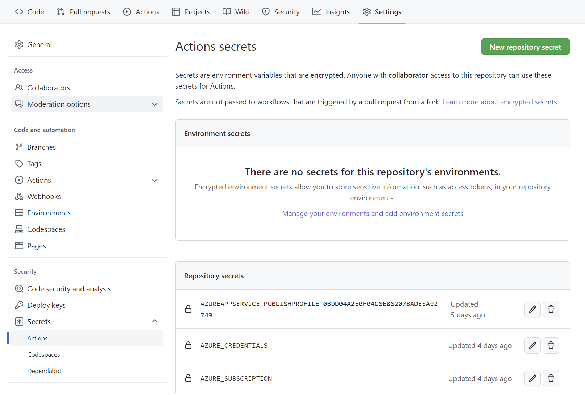

- 登録する内容を入力

  - **Name**: GH_TOKEN

  - **Secret**: 発行した Personal access tokens

    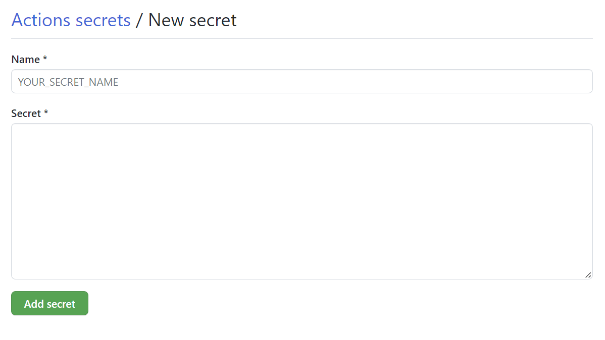

- "**Add secret**" をクリックし、シークレットを登録

    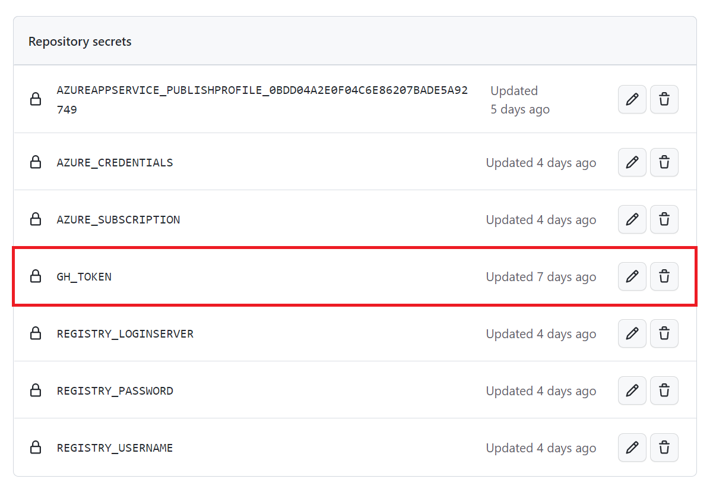

<br />

### Task 4: Azure Container Instances への Self-Hosted Runner の展開

- Self-Hosted Runner の構築手順は "**Settings**" の "**Actions**" - "**Runners**" から確認可

  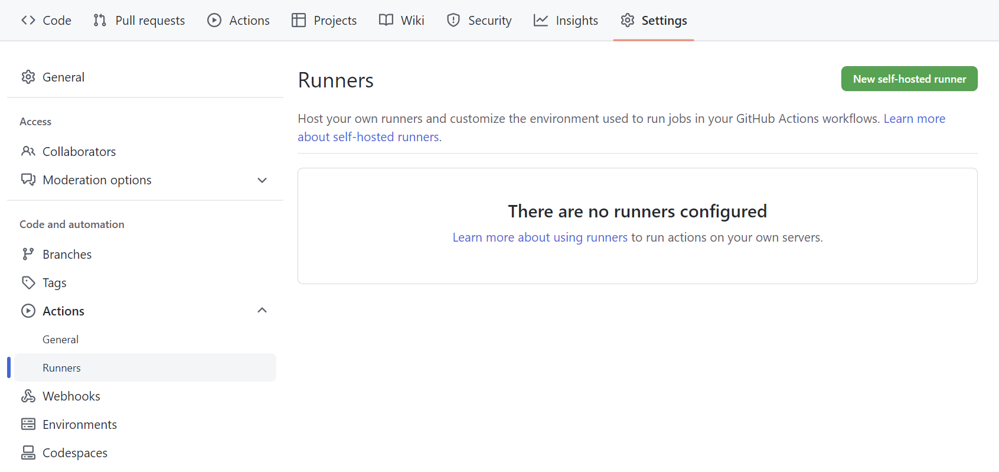

- "**New self-hosted runner**" のクリックで OS ごとのインストール スクリプトの入手、構成手順を確認

  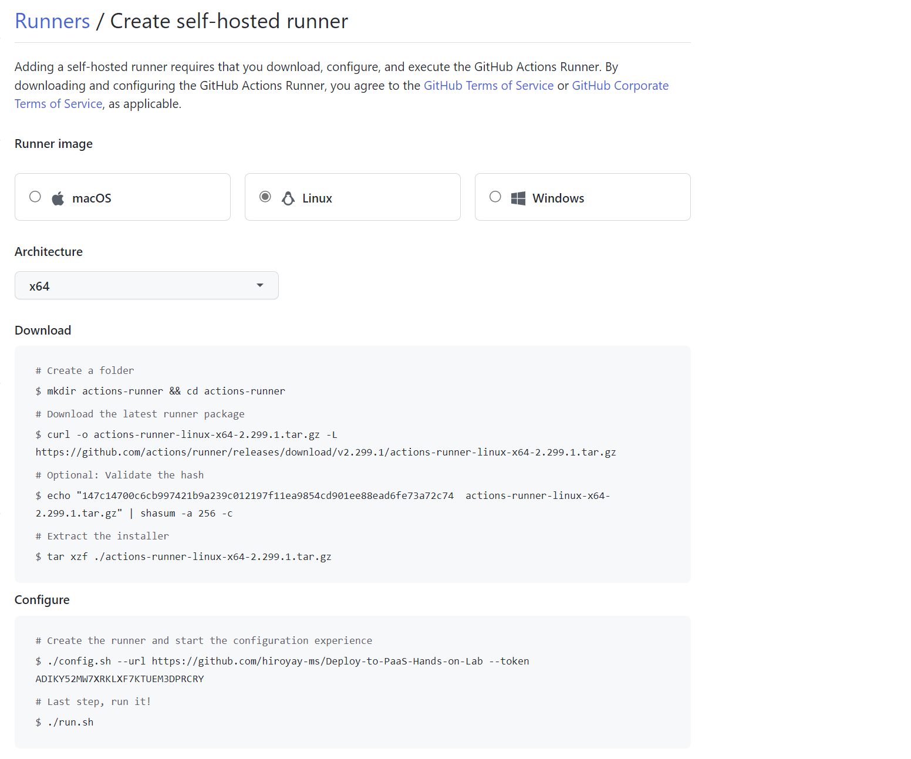

- GitHub Actions のワークフローでコンテナ イメージとしてビルドし Azure Container Instances へ展開

  ※ Dockerfile, ワークフローは事前準備済み

    - [dockerfile](https://github.com/kohei3110/Deploy-to-PaaS-Hands-on-Lab/blob/main/.docker/runner/dockerfile)

    - [deploy-runner-to-aci.yml](https://github.com/kohei3110/Deploy-to-PaaS-Hands-on-Lab/blob/main/.github/workflows/deploy-runner-to-aci.yml)

- ワークフローを実行

  - **リソース グループ名**: ワークショップで使用中のリソース グループ

  - **仮想ネットワーク名**: vnet-1 (事前展開済みの仮想ネットワーク)

  - **サブネット名**: Subnet-2 (仮想ネットワーク内のサブネット名)

  - **コンテナー グループ名**: aci-runner-xx (xx は数字、任意の名前で OK)

  - **GitHub アカウント**: 自身の GitHub アカウント名

  - **リポジトリ**: Deploy-to-PaaS-Hands-on-Lab

    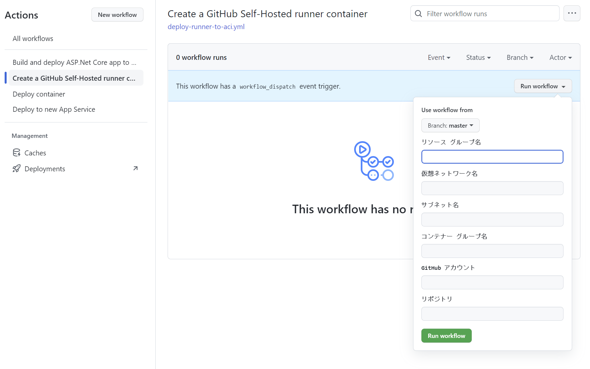

- ワークフローが正常に完了することを確認

  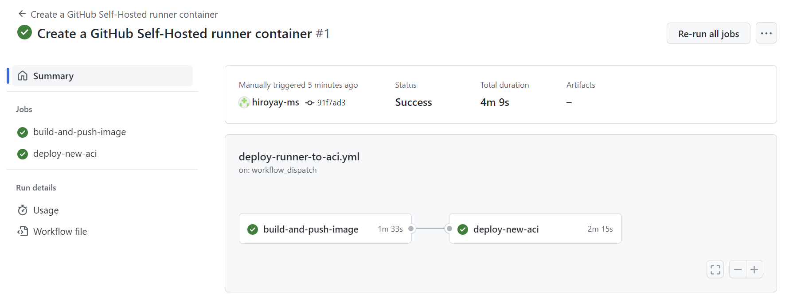

- Azure ポータルへアクセスし、Azure Container Registry の管理ブレードへ移動

- "**gh_runner**" リポジトリにイメージが登録されていることを確認

  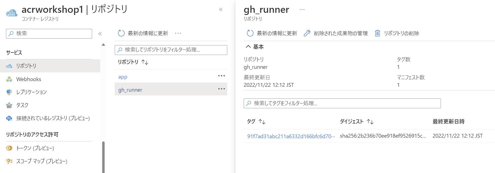

- Azure Container Instances の管理ブレードへアクセス

- "**コンテナー**" の "**ログ**" を確認

  

  ※ start.sh が実行され、runner の登録が実行されていることを確認

  ※ Runner のラベルに既定の self-hosted, Linux, X64 に加えて container が追加されていることを確認

- GitHub リポジトリの "**Settings**" の "**Actions**" - "**Runners**" へアクセス

- Runner が登録されていることを確認

  

<br />

### Task 5: ワークフローでの Self-Hosted Runner の利用

- App Service へアプリを展開するワークフロー ファイルを選択

- deploy ジョブの実行環境を Self-Hosted Runner を使用するように変更

  ```
  runs-on: [self-hosted, Linux, X64, container]
  ```

  ※ Self-Hosted Runner の指定は登録時に付与したラベルで実施

- アプリケーションの変更

- ローカル Git にコミットを行い、リモート リポジトリへプッシュを実行

- ワークフローを実行

  

- ワークフローが正常に完了したことを確認

  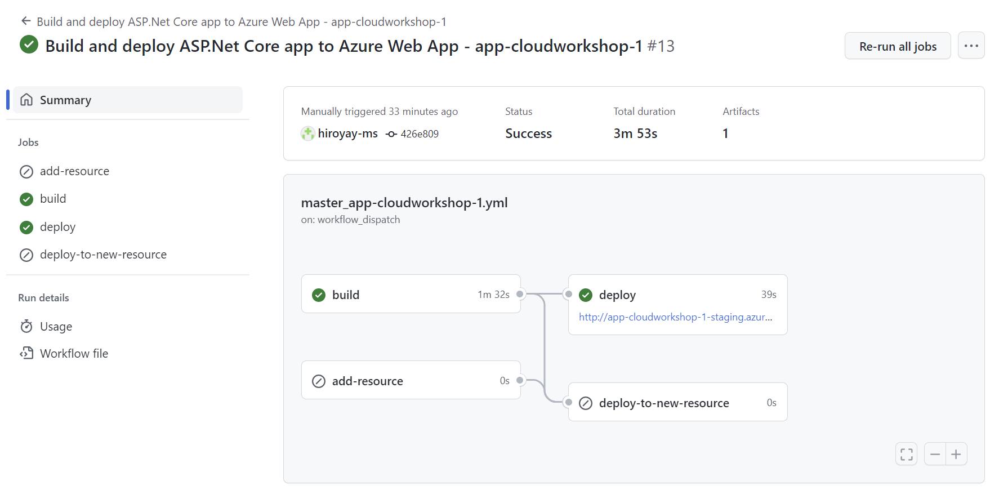

- Azure ポータルへアクセスし App Service の管理ブレードの "**概要**" タブから "**URL**" をクリック

  

- アプリケーションへ正常に展開されていることを確認

<br />
