Azure PaaS CI/CD Hands-on lab  
Dec 2022

<br />

### Contents

- [Exercise 1: 開発ツールから App Service への Web アプリの展開](#exercise-1-開発ツールから-app-service-への-web-アプリの展開)
- [Exercise 2: GitHub Actions を使用した App Service への Web アプリの展開](#exercise-2-github-actions-を使用した-app-service-への-web-アプリの展開)
- [Exercise 3: ステージング環境への展開とスワップ操作による本番環境への昇格](#exercise-3-ステージング環境への展開とスワップ操作による本番環境への昇格)
- [Exercise 4: GitHub Actions を使用した Container Apps への Web アプリの展開](#exercise-4-github-actions-を使用した-container-apps-への-web-アプリの展開)
- [Exercise 5: GitHub Actions による Azure リソースの展開](#exercise-5-github-actions-による-azure-リソースの展開)
  <br />

## Exercise 1: 開発ツールから App Service への Web アプリの展開

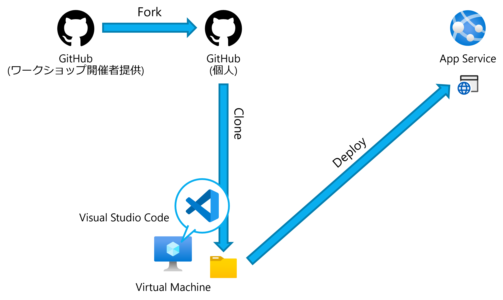

### Task 1: リポジトリのフォーク

- Web ブラウザを起動し、"<a href="https://github.com/kohei3110/Deploy-to-PaaS-Hands-on-Lab" target="_blank">ワークショップのリポジトリ</a>" へ移動

- 画面右上の Fork をクリック

  

- 自身のアカウントにリポジトリが複製されていることを確認

<br />

### Task 2: 開発環境へのリポジトリのクローン

- Fork したリポジトリの "**Code**" をクリック

  表示されるツール チップよりリポジトリの URL をコピー

  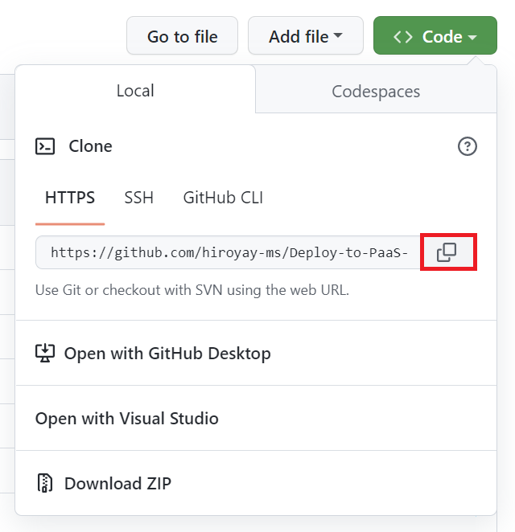

- Visual Studio Code を起動

- "**Terminal**" - "**New Terminal**" を選択し、ターミナルを表示

  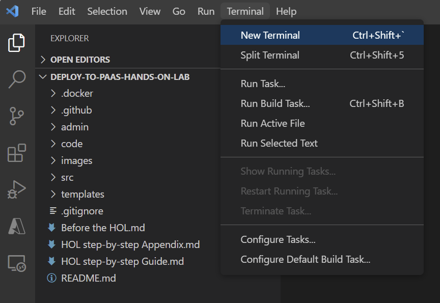

- Git の初期設定を実行

  - ユーザー名の設定

    ```
    git config --global user.name "User Name"
    ```

    ※ User Name を自身の名前に変更

  - Email アドレスの設定

    ```
    git config --global user.email Email@Address
    ```

    ※ {Email Address} を使用するメール アドレスに変更

  - 設定値の確認

    ```
    git config --list --global
    ```

    ※ 設定したユーザー名・メール アドレスが出力されたら OK

    ```
    git remote -v
    ```

    ※ クローン先の GitHub URL が出力されたら OK

- サイドバーから Explorer を選択し "\*\*Clone Repository" をクリック

  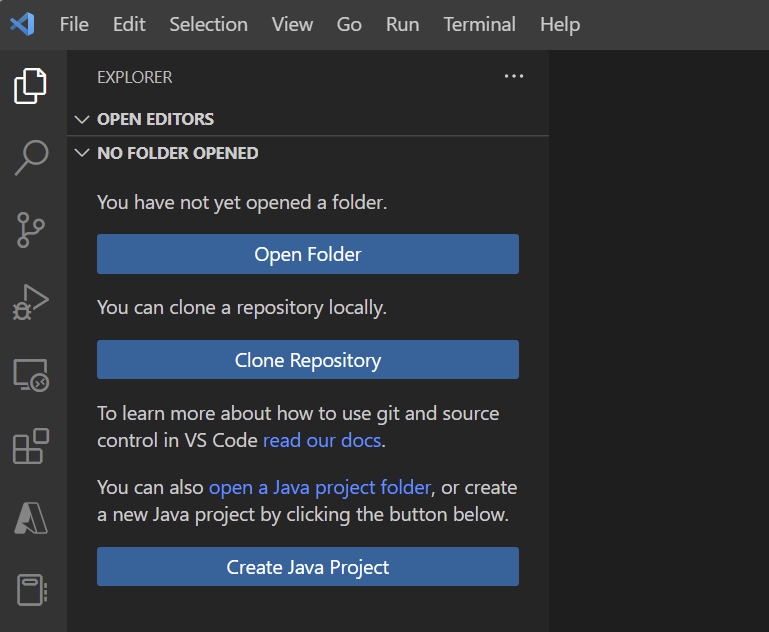

- リポジトリの URL の入力を求められるためコピーした URL を貼り付け Enter キーを押下

  

- 複製先となるローカル ディレクトリを選択

  GitHub の認証情報が求められる場合は、アカウント名、パスワードを入力し認証を実施

- 複製されたリポジトリを開くかどうかのメッセージが表示されるので "**Open**" をクリック

- Explorer に複製したリポジトリのディレクトリ、ファイルが表示

  

- ローカルでアプリケーションを実行を確認

  <details>
  <summary>C#</summary>

  - "**Terminal**" - "**New Terminal**" を選択

    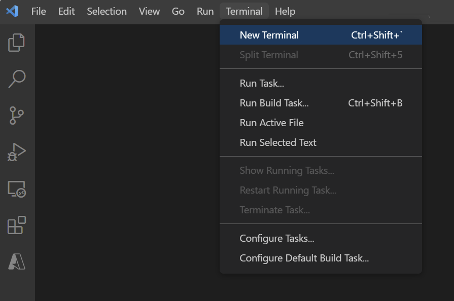

  - C# の ASP.NET Core プロジェクトのディレクトリへ移動

    ```
    cd src/CS
    ```

  - アプリケーションを実行

    ```
    dotnet run
    ```

  - ターミナルに以下のようなメッセージが表示（Web アプリをテストする URL が https\://localhost:{port} で表示）

    HTTPS URL を Ctrl キーを押しながらクリック

    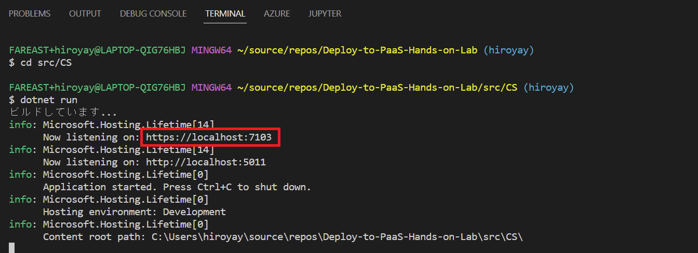

  - Web ブラウザが起動し、アプリケーションを表示

    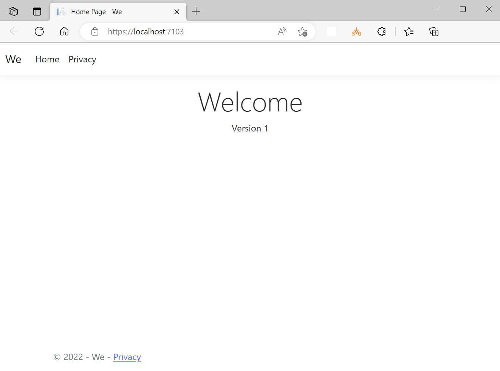

  - ターミナルで Ctrl + C を押下してアプリケーションを終了

  </details>

  <details>
  <summary>Java</summary>

  - "**Terminal**" - "**New Terminal**" を選択

    

  - Java の SpringBoot プロジェクトのディレクトリへ移動

    ```
    cd src/Java/webapp-java
    ```

  - アプリケーションを実行

    ```
    .\mvnw install
    .\mvnw spring-boot:run
    ```

  - Web ブラウザを起動し、http://localhost:8080 にアクセスしてアプリケーションを表示

    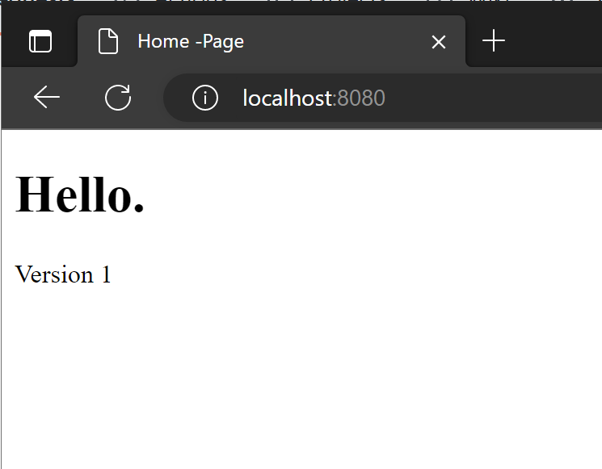

  - ターミナルで Ctrl + C を押下してアプリケーションを終了

  </details>

<br />

### Task 3: App Service の作成

- Web ブラウザを起動し <a href="https://portal.azure.com/">Azure ポータル</a> へアクセス

- "**+作成** をクリック

  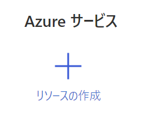

- Web アプリの "**作成**" をクリック

  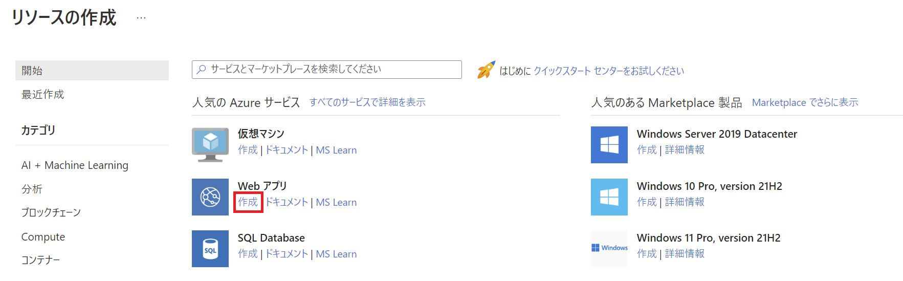

- Web アプリの作成

  - "**基本**"

    - プロジェクトの詳細

      - **サブスクリプション**: ワークショップで使用中のサブスクリプション

      - **リソース グループ**: 展開先のリソース グループ

    - インスタンスの詳細

      - **名前**: 一意となる名前を入力

      - **公開**: コード

      - **ランタイム スタック**: 展開するアプリのランタイムを選択（**Java の場合は `Java 17` を選択**）

      - **オペレーティング システム**: Windows（**Java の場合は Linux**）

      - **地域**: リソース グループと同じ地域を選択

    - App Service プラン

      - **プラン**: 新規作成（既定の名前で OK）

      - **SKU とサイズ**: Standard S1

      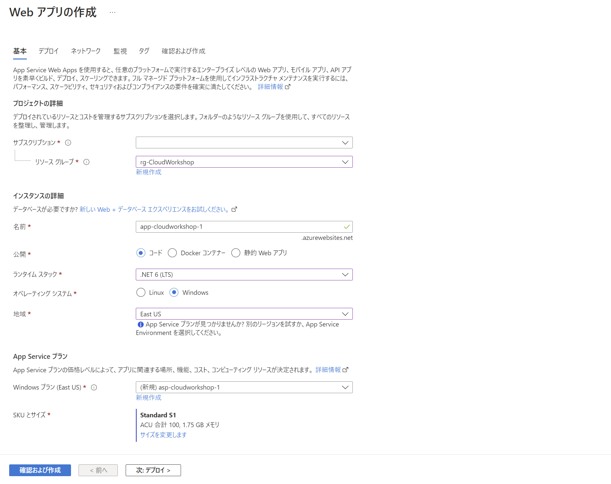

  - "**デプロイ**"

    - **継続的デプロイ**: 無効化

      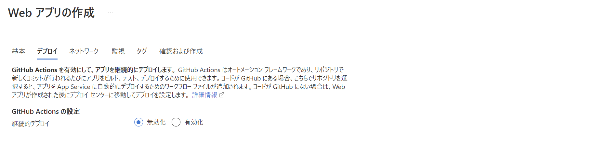

  - "**ネットワーク**"

    - **ネットワーク インジェクションを有効にする**: オフ

      

  - "**監視**"

    - **Application Insights を有効にする**: いいえ

      

- "**確認および作成**" をクリックし、指定した内容を確認

- "**作成**" をクリックしリソースを展開

  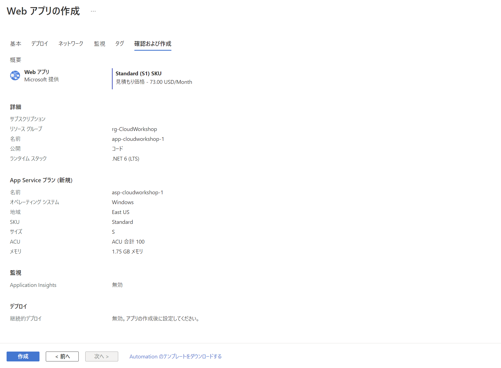

<br />

### Task 4: App Service へ Web アプリを発行

- デプロイ パッケージの生成

  <details>
  <summary>C#</summary>

  - "**Terminal**" - "**New Terminal**" を選択

    

  - C# の ASP.NET Core プロジェクトのディレクトリへ移動

    ```
    cd src/CS
    ```

  - デプロイ パッケージの生成

    ```
    dotnet publish -c Relase -o ./bin/Publish
    ```

    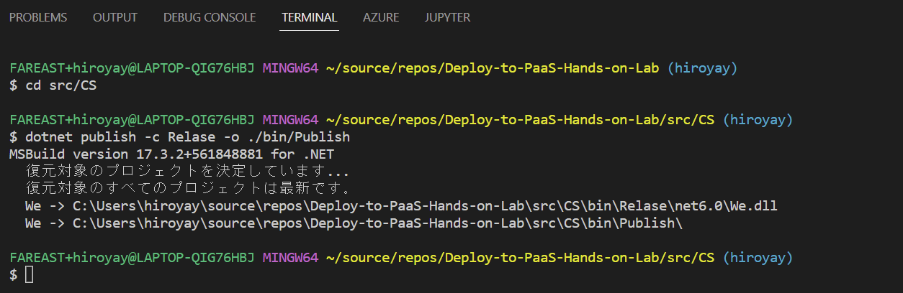

  - bin フォルダー内に Publish サブフォルダーが生成

    ※ Publish フォルダー内には App Service に展開するファイルが格納

    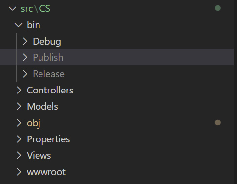

  - Visual Studio Code のサイドバーから Azure Tool を選択

  - "**Sign in to Azure...**" をクリック

    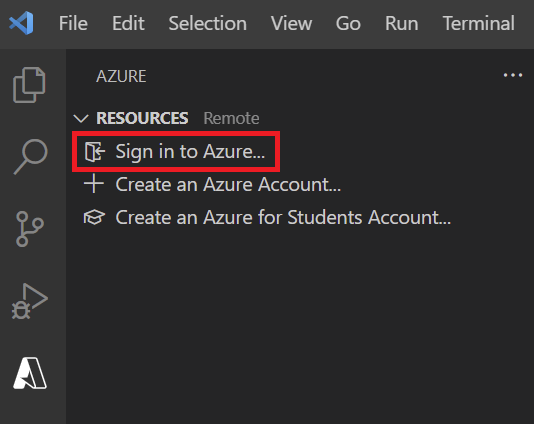

  - Web ブラウザが起動し、認証が求められるので、アカウント名、パスワードを入力し認証を実行

  - サブスクリプションの選択を求められる場合は、使用するサブスクリプションを選択

  - RESOURCES パネルに選択したサブスクリプションの情報が表示

    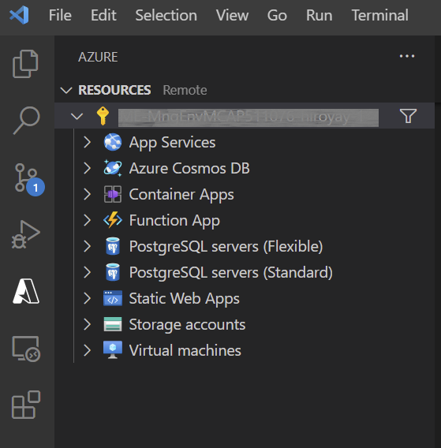

  - App Services を展開し、先の手順で作成した App Service が表示されることを確認

    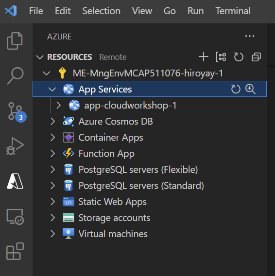

  - App Service を右クリックし "**Deploy to Web App...**" を選択

    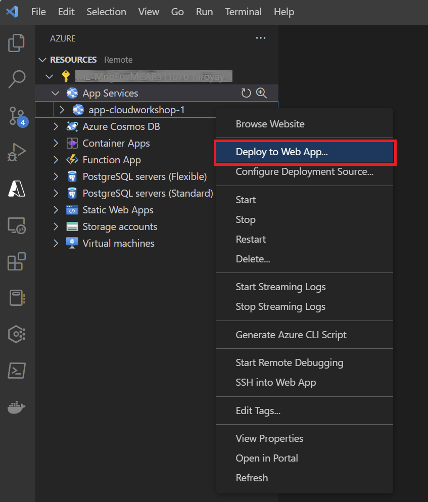

  - "**Browse...**" を選択し、展開するアプリケーション パッケージが格納されているフォルダを選択

  - 確認のメッセージが表示されるので "**Deploy**" をクリック

  - 展開完了後 App Service を右クリックし "**Browse Website**" を選択

  - Web ブラウザが起動し、アプリケーションが表示されることを確認

  </details>

  <details>
  <summary>Java</summary>

  - "**Terminal**" - "**New Terminal**" を選択

    

  - Java の Spring Boot プロジェクトのディレクトリへ移動

    ```powersshell
    cd src/Java/webapp-java
    ```

  - デプロイ パッケージの生成

    ```powershell
    .\mvnw package
    ```

  - target フォルダーが生成される

    ※ target フォルダー内には App Service に展開する jar ファイルが格納

    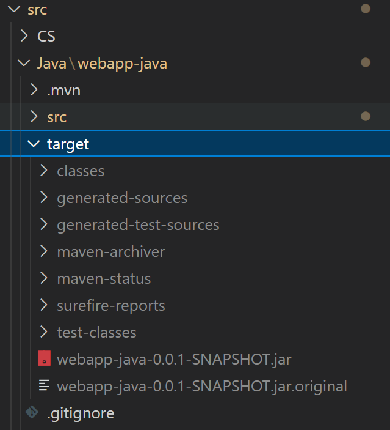

  - Maven Plugin for Azure WebApps を使用するように pom.xml を修正

  - src/Java/webapp-java/pom.xml の plugins 要素に次の内容を追加

  ```xml
      <plugin>
      <groupId>com.microsoft.azure</groupId>
      <artifactId>azure-webapp-maven-plugin</artifactId>
      <version>2.7.0</version>
      <configuration>
        <subscriptionId>111111-11111-11111-1111111</subscriptionId>
        <resourceGroup>spring-boot-xxxxxxxxxx-rg</resourceGroup>
        <appName>spring-boot-xxxxxxxxxx</appName>
        <deployment>
        <resources>
          <resource>
          <type>jar</type>
          <directory>${project.basedir}/target</directory>
          <includes>
            <include>*.jar</include>
          </includes>
          </resource>
        </resources>
        </deployment>
      </configuration>
     </plugin>
  ```

  - 今追加した個所のうち、次の 3 か所を作成済みの WebApps 情報に修正する

    1. **subscriptionId**
    1. **resourceGroup**
    1. **appName**

    - 3 つの情報は作成した AppService の概要に記載されている

  - maven コマンドを使用してデプロイ

  ```powershell
  .\mvnw azure-webapp:deploy
  ```

  - Web ブラウザが起動し、アプリケーションが表示されることを確認

  </details>

<br />

## Exercise 2: GitHub Actions を使用した App Service への Web アプリの展開

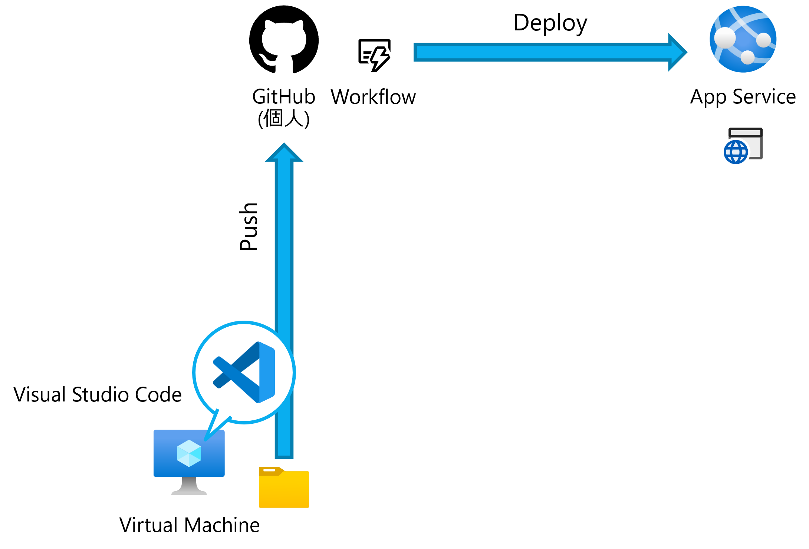

### Task 1: App Service への継続的デプロイの設定

- Web ブラウザを起動し <a href="https://portal.azure.com/">Azure ポータル</a> へアクセス

- App Service の管理ブレードから "**デプロイ センター**" を選択

- ソースに "**GitHub**" を選択

  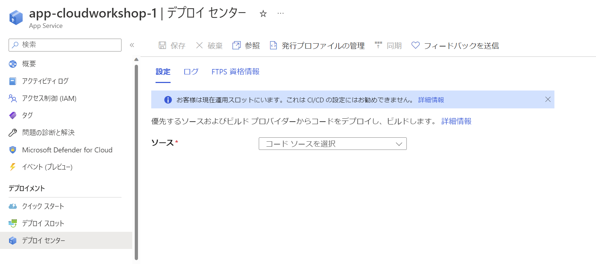

- "**承認する**" をクリック

  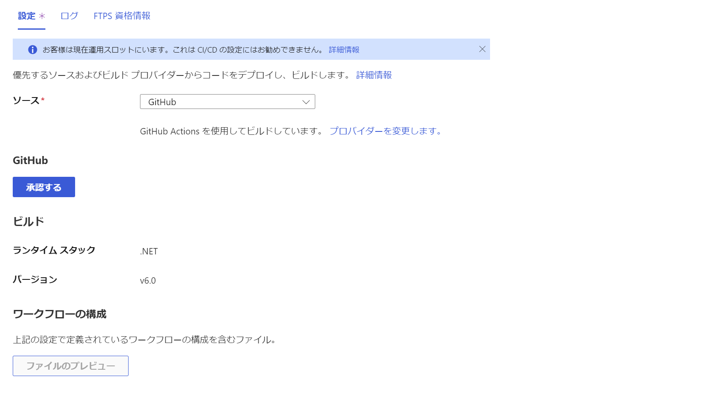

  **※Java の場合は以下のようになる。**

  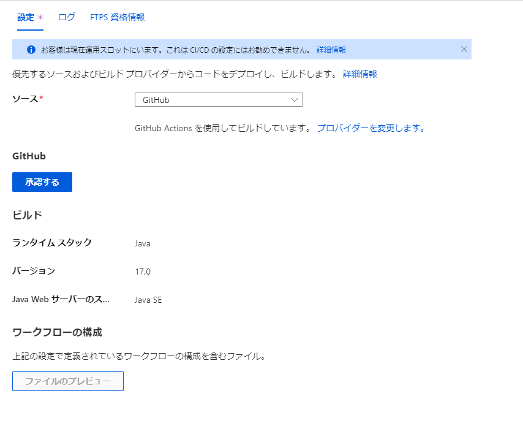

- アカウント名、パスワードを入力し、サインインを実行

  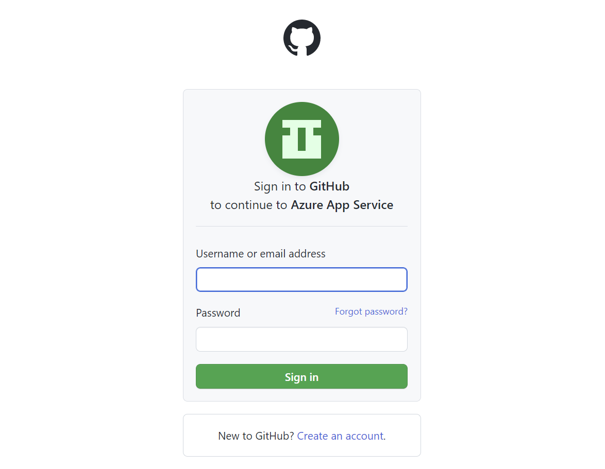

- GitHub リポジトリの選択

  - **組織**: 自身のアカウント

  - **リポジトリ**: Deploy-to-PaaS-Hands-on-Lab

  - **ブランチ**: main

  - **ワークフロー オプション**: ワークフローの追加

    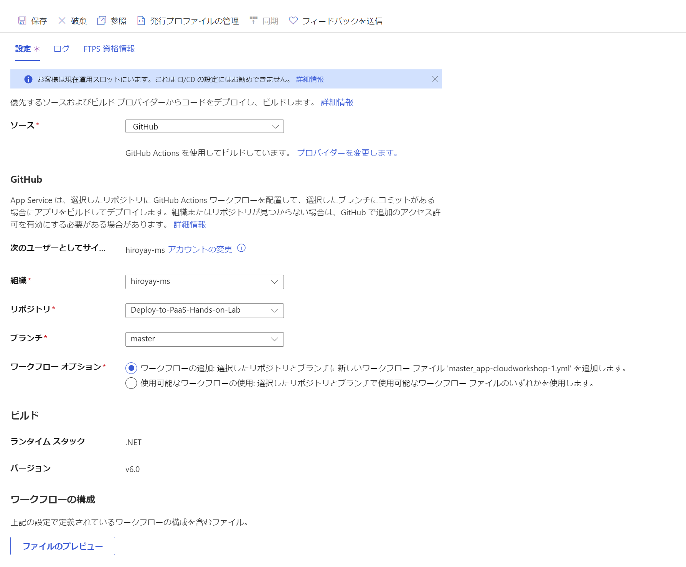

- "**保存**" をクリック

<br />

### Task 2: ワークフローの修正

- Web ブラウザで GitHub リポジトリへアクセス

- .github/workflows に App Service の設定によりワークフロー ファイル (.yml) が追加されていることを確認

  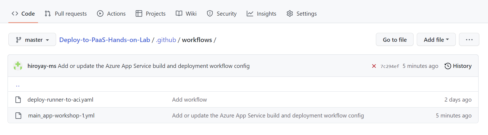

  ※ ファイル名は {ブランチ名}\_{App Service 名}.yml

  ※ ブランチ名が "**main**"、App Service 名が "**app-workshop-1**" のとき、ファイルは "**main_app-workshop-1.yml**" の名前で生成

- "**Settings**" タブの "**Secrets**" - "**Actions**" を選択

  シークレットに App Service への展開に使用する発行プロファイルが登録されていることを確認

  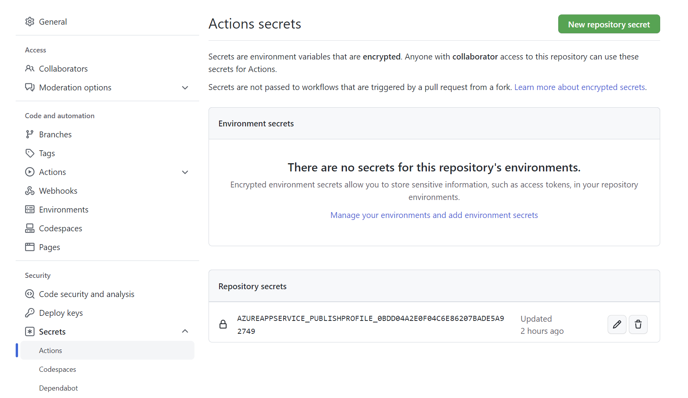

- "**Actions**" タブを選択し、ワークフローの実行履歴を確認

  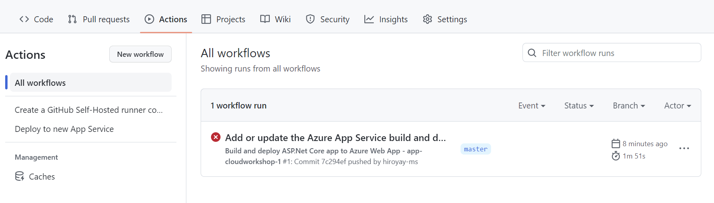

- 追加したワークフローの実行が失敗しているため、クリックして内容を確認

- "**build**" をクリックして詳細を確認

  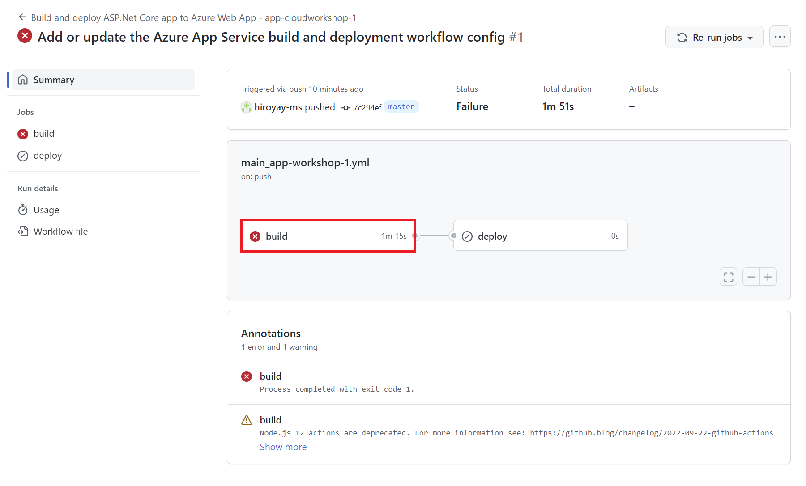

- 各ステップのログを確認し、エラーを特定

  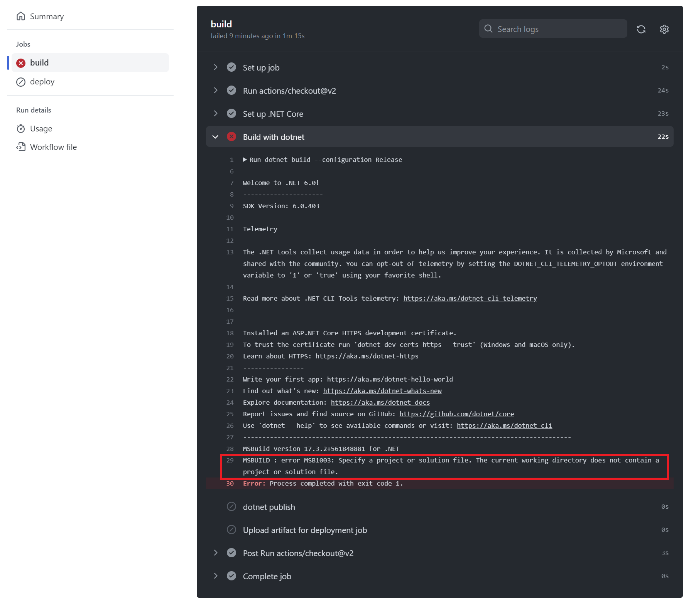

  **※Java の場合は以下のようになる。**

  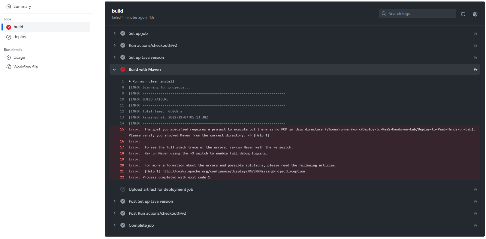

- Visual Studio Code のサイドバーで "**Source Control**" を選択

- "**...**" - "**Pull**" をクリック

  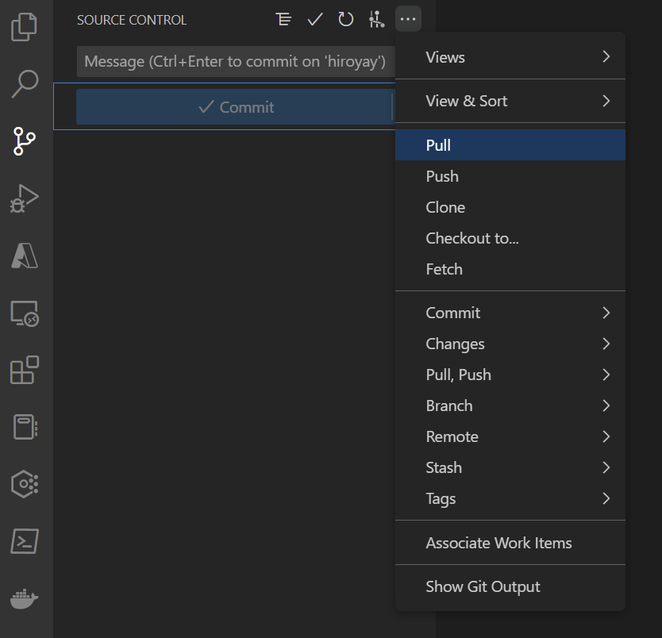

- ワークフロー ファイルを選択しエディタで表示

  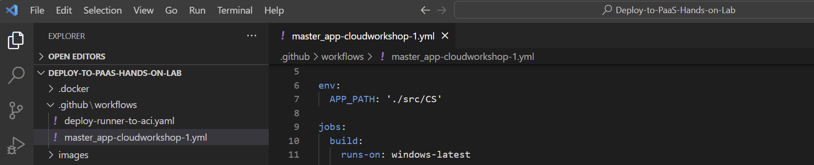

- エディタで .yml ファイルを編集

  <details>
  <summary>C#</summary>

  - **on** セクションでトリガー イベントを手動のみに変更

  - **env** セクションで環境変数 APP_PATH を定義

  - **build** ジョブの dotnet コマンド、アーティファクトへのアップロードする成果物のパスに定義した APP_PATH を使用

  - **deploy** ジョブは変更なし

    ```yml
    on:
      workflow_dispatch:

    env:
      APP_PATH: "./src/CS"

    jobs:
      build:
        runs-on: windows-latest

        steps:
          - uses: actions/checkout@v2

          - name: Set up .NET Core
            uses: actions/setup-dotnet@v1
            with:
              dotnet-version: "6.0.x"
              include-prerelease: true

          - name: Build with dotnet
            run: dotnet build ${{ env.APP_PATH }} --configuration Release

          - name: dotnet publish
            run: dotnet publish ${{ env.APP_PATH }} -c Release -o ${{ env.APP_PATH }}/myapp

          - name: Upload artifact for deployment job
            uses: actions/upload-artifact@v2
            with:
              name: .net-app
              path: ${{ env.APP_PATH }}/myapp
    ```

  </details>

  <details>
  <summary>Java</summary>

  - **on** セクションでトリガー イベントを手動のみに変更

  - **env** セクションで環境変数 APP_PATH を定義

  - **build** mvn コマンド実施前に working directory を移動、アーティファクトへのアップロードする成果物のパスに定義した APP_PATH を使用。また actions/upload-artifact のバージョンが@2 で作成されるがこれは古いため@3 にする

  - **deploy** actions/download-artifact のバージョンが@2 で作成されるがこれは古いため@3 にする

    ```yml
    on:
      workflow_dispatch:

    env:
      APP_PATH: "src/Java/webapp-java"

    jobs:
      build:
        runs-on: ubuntu-latest

        steps:
          - uses: actions/checkout@v2

          - name: Set up Java version
            uses: actions/setup-java@v1
            with:
              java-version: "17"

          - name: Build with Maven
            run: |
              cd ${{ env.APP_PATH }}
              mvn clean install

          - name: Upload artifact for deployment job
            uses: actions/upload-artifact@v3
            with:
              name: java-app
              path: "${{ github.workspace }}/${{ env.APP_PATH }}/target/*.jar"

      deploy:
        runs-on: ubuntu-latest
        needs: build
        environment:
          name: "Production"
          url: ${{ steps.deploy-to-webapp.outputs.webapp-url }}

        steps:
          - name: Download artifact from build job
            uses: actions/download-artifact@v3
            with:
              name: java-app

          - name: Deploy to Azure Web App
            id: deploy-to-webapp
            uses: azure/webapps-deploy@v2
            with:
              app-name: "******"
              slot-name: "Production"
              publish-profile: ${{ secrets.AZUREAPPSERVICE_PUBLISHPROFILE_**************** }}
              package: "*.jar"
    ```

  </details>

<br />

### Task 3: アプリケーションの更新

- ワークフローからの展開によりアプリケーションが更新されたことを確認するために、コードを修正

  <details>
  <summary>C#</summary>

  - src/CS/Views/Home の Index.cshtml を選択

    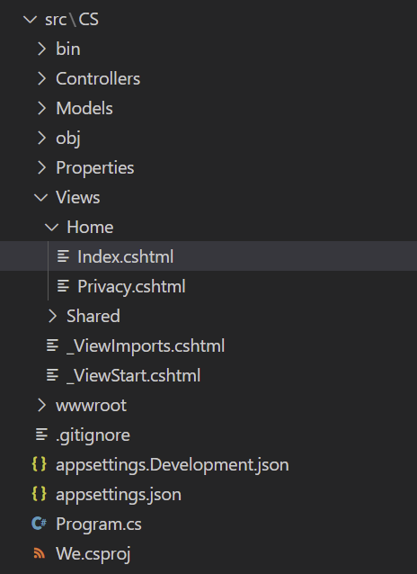

  - エディタでバージョン番号を変更

    

  </details>

  <details>
  <summary>Java</summary>

  - src/Java/webapp-java/src/main/resources/templates の root.html を選択

    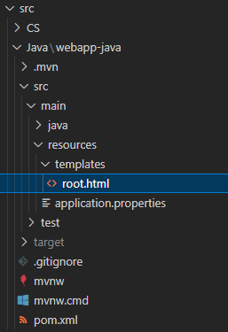

  - エディタでバージョン番号を変更

    

  </details>

- サイドバーで Source Controle を選択、コメントを入力し変更をコミット

  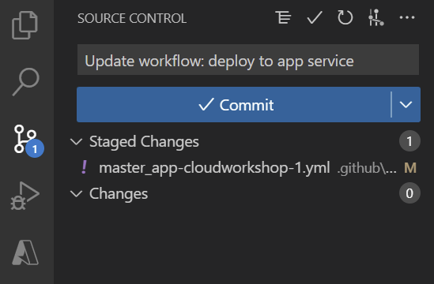

- GitHub リポジトリと同期

  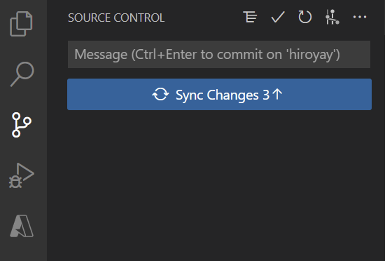

  **※Java の場合は以下のようになる。**

  

<br />

### Task 4: ワークフローの実行

- Web ブラウザで GitHub リポジトリへアクセス、"**Actions**" タブを選択

- アプリを展開するワークフローを選択

- "**Run workflow**" をクリックし、表示されるツールチップから "**Run workflow**" をクリック

  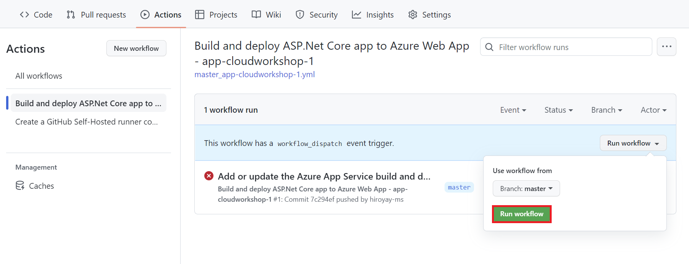

- ワークフローの実行状況を確認

   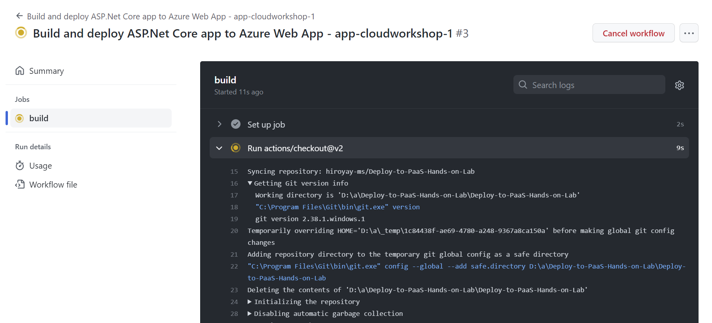

- ワークフローの完了を確認

   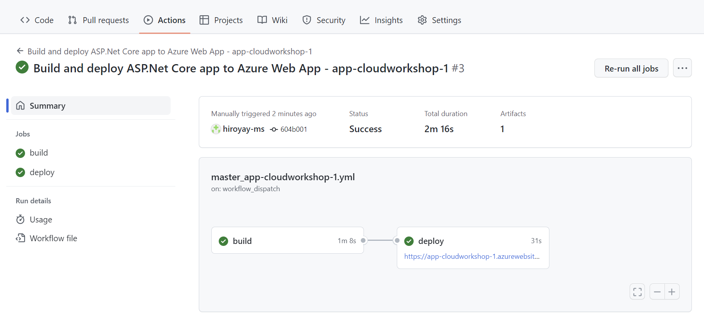

- Azure ポータルで App Service の管理ブレードへアクセス

- URL をクリックし、新しいタブでアプリケーションが更新されていることを確認

<br />

## Exercise 3: ステージング環境への展開とスワップ操作による本番環境への昇格

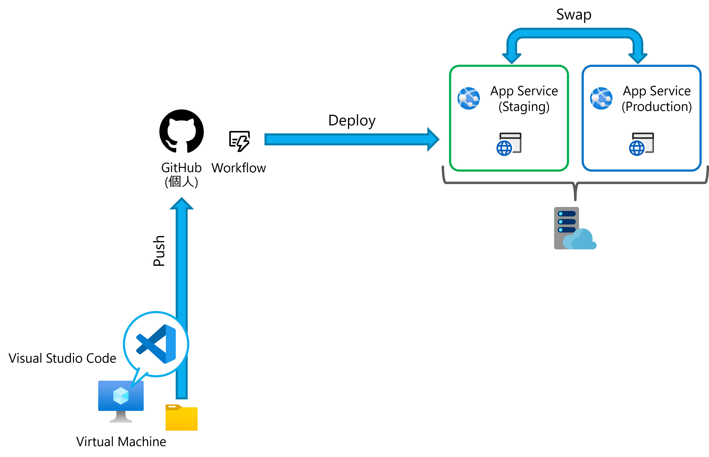

### Task 1: ステージング環境の準備

- Azure ポータルで App Service の管理ブレードへアクセス、"**デプロイ スロット**" を選択

- "**+ スロットの追加**" をクリック

  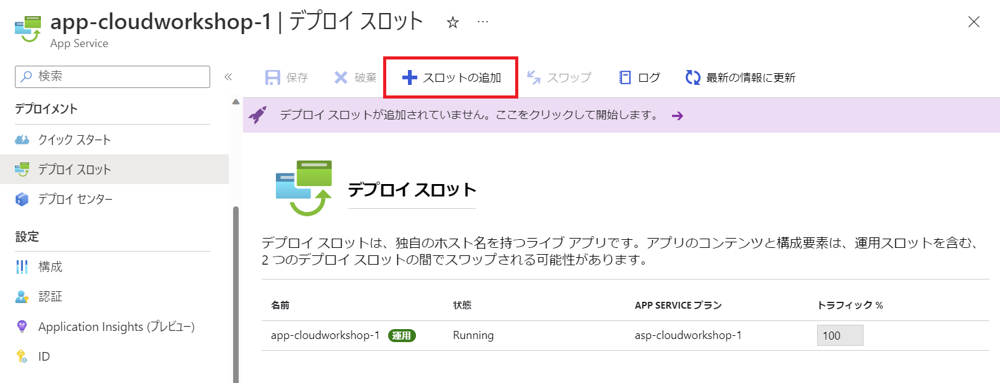

- 名前に "**staging**" と入力し、"**追加**" をクリック

  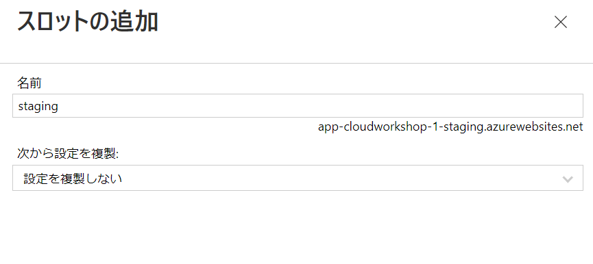

- 追加されたスロットをクリックし、管理ブレードへ移動

  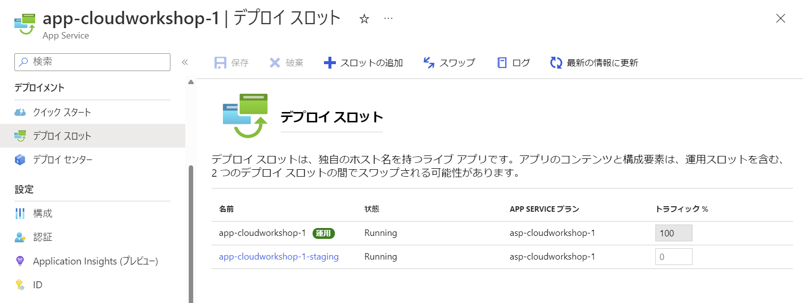

- "**発行プロファイルの取得**" をクリック

  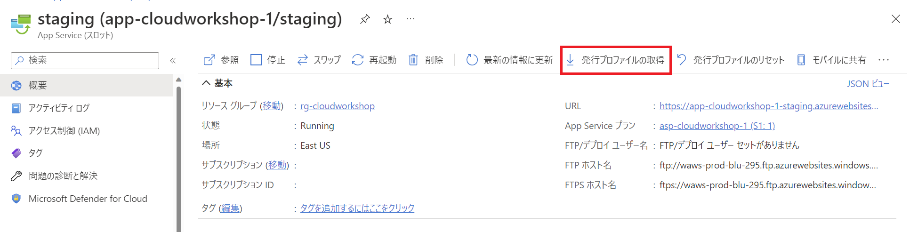

- ダウンロードした発行プロファイルをメモ帳などのエディタで表示

- Web ブラウザで GitHub リポジトリへアクセス、"**Settings** タブを選択

- "**Secrets**" - "**Actions**" を選択し、App Service により登録されたシークレットを更新画面を表示

  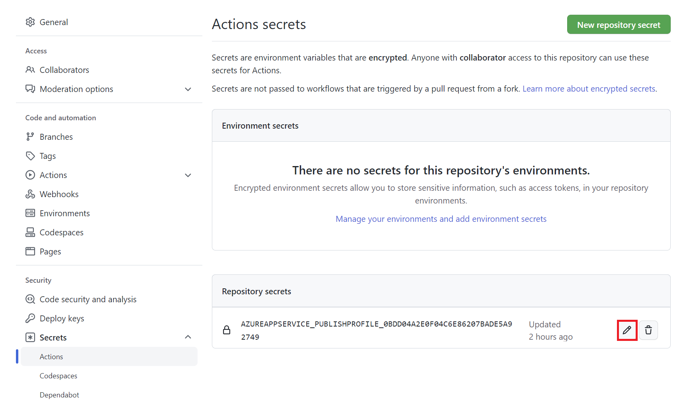

- 発行プロファイルの内容をコピーし、**Value** へ貼り付け

  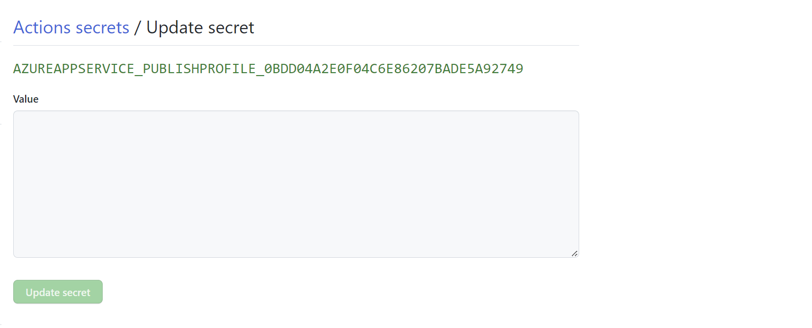

- "**Update secret**" をクリックし、シークレット情報を更新

<br />

### Task 2: ワークフローの修正

- Visual Studio Code で、ワークフロー ファイルを選択しエディタで表示

  

- uses: azure/webapps-deploy@v2 セクションで展開先の slot-name を Production から staging へ変更

  

<br />

### Task 3: アプリケーションの更新

- ワークフローからの展開によりアプリケーションが更新されたことを確認するために、コードを修正

  <details>
  <summary>C#</summary>

  - src/CS/Views/Home の Index.cshtml を選択

    

  - エディタでバージョン番号を変更

    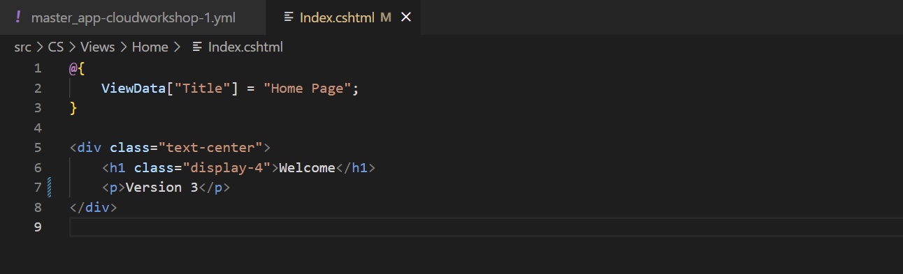

  </details>

  <details>
  <summary>Java</summary>

  - src/Java/webapp-java/src/main/resources/templates の root.html を選択

    

  - エディタでバージョン番号を変更

    

  </details>

- サイドバーで Source Controle を選択、コメントを入力し変更をコミット

  

- GitHub リポジトリと同期

  

<br />

### Task 4: ワークフローの実行

- Web ブラウザで GitHub リポジトリへアクセス、"**Actions**" タブを選択

- アプリを展開するワークフローを選択

- "**Run workflow**" をクリックし、表示されるツールチップから "**Run workflow**" をクリック

  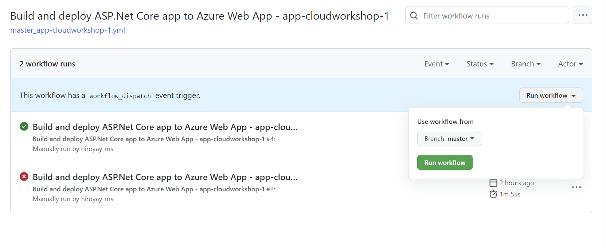

- ワークフローが正常に完了することを確認

  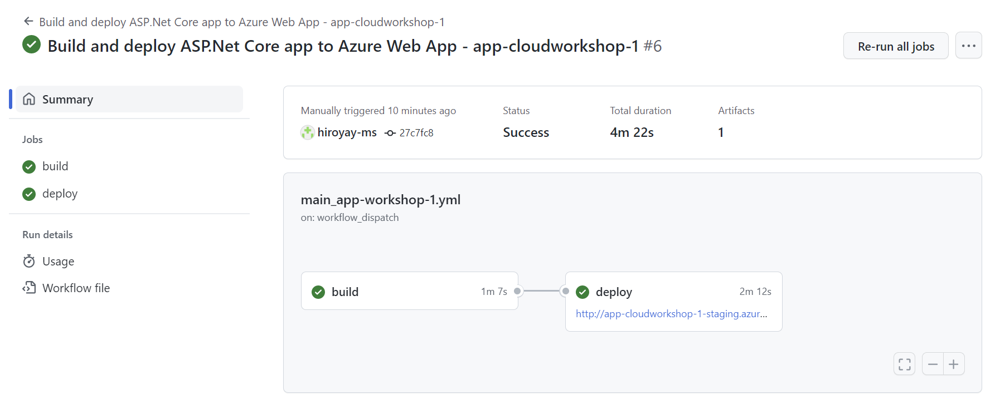

- App Service のステージング環境の管理ブレードへアクセス、URL をクリックし、アプリケーションの更新を確認

<br />

### Task 5: スワップ操作

- App Service の管理ブレードで "**デプロイ スロット**" を選択

- "**スワップ**" をクリック

  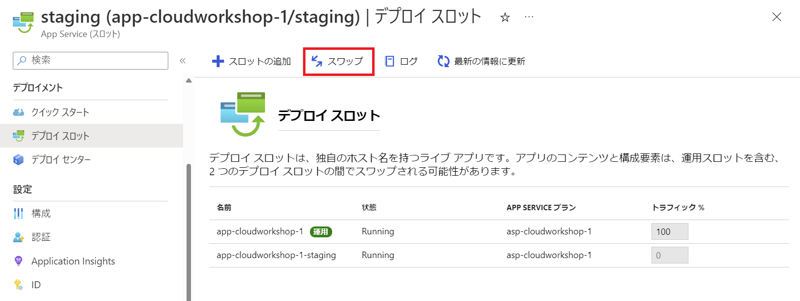

- ソースにステージング環境、ターゲットにプロダクション環境が表示されていることを確認し "**スワップ**" をクリック

  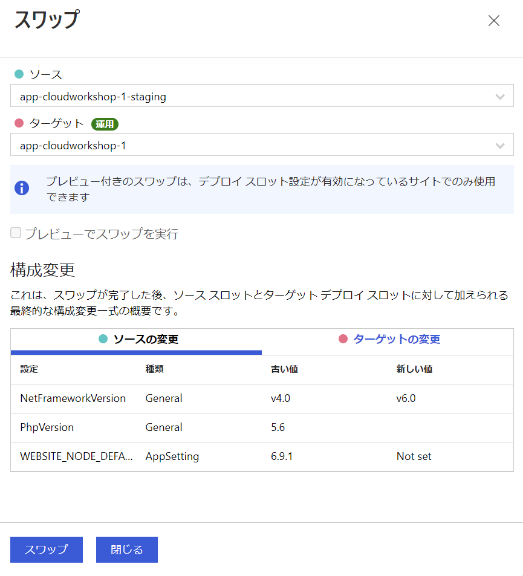

- App Service の管理ブレードの "**概要**" タブから "**URL**" をクリック

  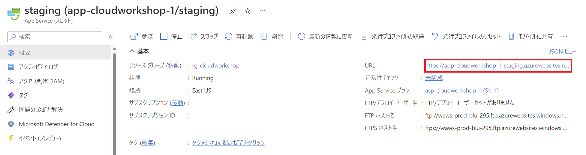

- ステージング環境と本番環境が切り替わっていることを確認

<br />

## Exercise 4: GitHub Actions を使用した Container Apps への Web アプリの展開

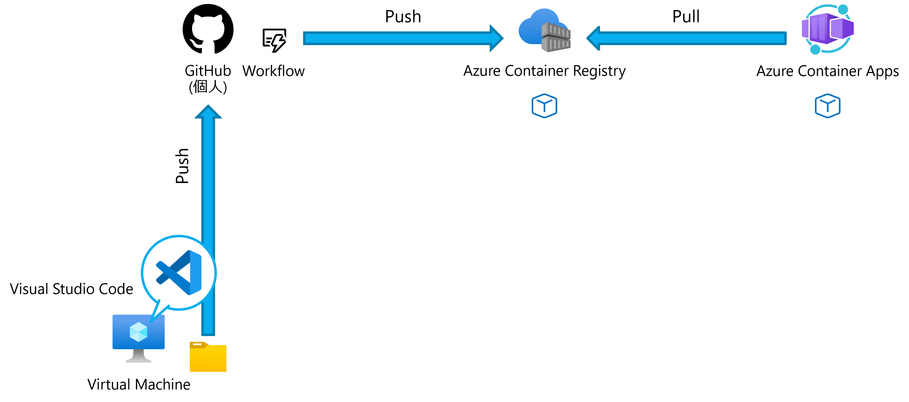

### Task 1: サービス プリンシパルの作成

- Cloud Shell を起動

  

- リソース グループのリソース ID を取得（リソース グループ名は使用環境に合わせて変更）

  ```
  groupId=$(az group show --name {リソース グループ名} --query id --output tsv)
  ```

- サービス プリンシパルの作成（名前は任意、リソース グループに対する共同作成者の権限を付与）

  ```
  az ad sp create-for-rbac --name "GitHub-Deploy" --scopes $groupId --role Contributor --sdk-auth
  ```

  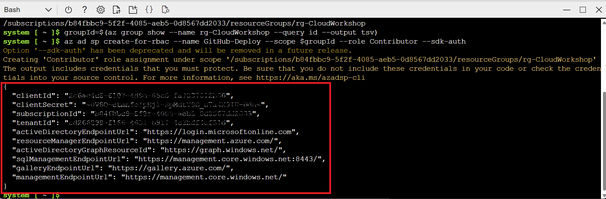

- 出力された結果を {} も含めてコピーし、メモ帳などに貼り付け

- リソース グループに対して共同作成者の権限が付与されていることを確認

  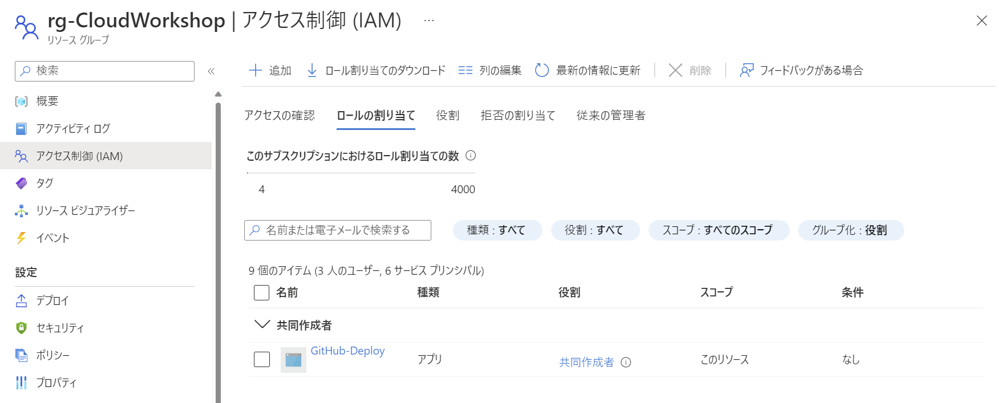

<br />

### Task 2: 資格情報の GitHub リポジトリへの保存

- Web ブラウザで GitHub リポジトリへアクセス、"**Settings** タブを選択

- "**Secrets**" - "**Actions**" に次のシークレットを登録

  | シークレット名       | 値                                                                 |
  | -------------------- | ------------------------------------------------------------------ |
  | AZURE_CREDENTIALS    | サービス プリンシパル作成時に出力された JSON 全体                  |
  | REGISTRY_LOGINSERVER | Azure Container Registry のログイン サーバー名                     |
  | REGISTRY_USERNAME    | Azure Container Registry の管理者のユーザー名                      |
  | REGISTRY_PASSWORD    | Azure Container Registry の管理者のパスワード                      |
  | AZURE_SUBSCRIPTION   | サービス プリンシパルの作成時に出力された JSON 内の subscriptionId |

  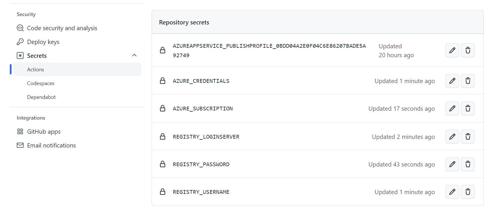

  - Azure Container Registry のログイン サーバー名、ユーザー名、パスワードは、管理ブレードのアクセス キーから取得

    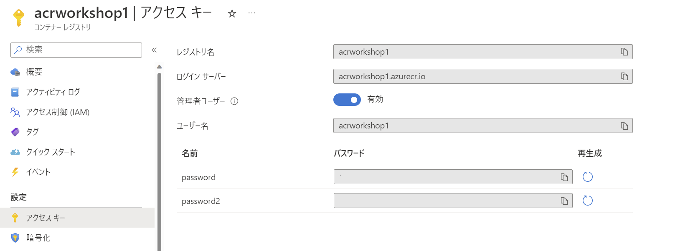

    ※ 管理者ユーザーを "**有効**" に設定

### Task 3: ワークフローの作成

- Visual Studio Code で .github/workflows に新しいワークフロー ファイル (.yml) を追加

- ワークフロー名とトリガー条件を記述

  ```
  name: Deploy container

  on:
    workflow_dispatch:
  ```

  ※ ワークフローは手動で実行するためトリガーは workflow_dispatch を指定

  <details>
  <summary>C#</summary>

  - アプリケーションのビルド ジョブを追加

    ```
    jobs:
      build:
        runs-on: ubuntu-latest
        env:
          APP_PATH: './src/CS'

        steps:
          - uses: actions/checkout@v2

          - name: Set up .NET Core
            uses: actions/setup-dotnet@v1
            with:
              dotnet-version: '6.0.x'
              include-prerelease: true

          - name: Build with dotnet
            run: dotnet build ${{ env.APP_PATH }} --configuration Release

          - name: dotnet publish
            run: dotnet publish ${{ env.APP_PATH }} -c Release -o ${{ env.APP_PATH }}/myapp

          - name: Upload artifact for deployment job
            uses: actions/upload-artifact@v2
            with:
              name: .net-app
              path: ${{ env.APP_PATH }}/myapp

    ```

    ※ App Service への展開を行うワークフローの build ジョブと同じ、環境変数はジョブ内で定義

  - Azure Container Registry へイメージをプッシュ

    ```
      push:
        runs-on: ubuntu-latest
        needs: build

        steps:
          - uses: actions/checkout@v2

          - name: Download artifact from build job
            uses: actions/download-artifact@v2
            with:
              name: .net-app
              path: release

          - name: Login via Azure Container Registry
            uses: azure/docker-login@v1
            with:
              login-server: ${{ secrets.REGISTRY_LOGINSERVER }}
              username: ${{ secrets.REGISTRY_USERNAME }}
              password: ${{ secrets.REGISTRY_PASSWORD }}

          - name: Docker build and push
            run: |
              docker build . -t ${{ secrets.REGISTRY_LOGINSERVER }}/app:${{ github.sha }} -f ./.docker/CS/dockerfile
              docker push ${{ secrets.REGISTRY_LOGINSERVER }}/app:${{ github.sha }}

    ```

    ※ needs フィールドの設定により build ジョブの完了を待ってから実行

    ※ Docker ファイルは事前に準備されたものを使用

    ※ リポジトリ名は app, タグには github.sha でコミット時のハッシュ文字列を使用

    <details>
    <summary>dockerfile</summary>

    ```docker
    FROM mcr.microsoft.com/dotnet/aspnet:6.0
    WORKDIR /app

    COPY ./release .

    ENTRYPOINT ["dotnet", "Web.dll"]
    ```

    ※ build ジョブで発行されたアプリケーションをイメージにコピー

    ※ エントリ ポイントを定義
    </details>

  </details>

  <details>
  <summary>Java</summary>

  - アプリケーションのビルド ジョブを追加

    ```yml
    jobs:
      build:
        runs-on: ubuntu-latest
        env:
          APP_PATH: "src/Java/webapp-java"

        steps:
          - uses: actions/checkout@v2

          - name: Set up Java version
            uses: actions/setup-java@v1
            with:
              java-version: "17"

          - name: Build with Maven
            run: |
              cd ${{ env.APP_PATH }}
              mvn clean install package

          - name: Upload artifact for deployment job
            uses: actions/upload-artifact@v3
            with:
              name: java-app
              path: "${{ github.workspace }}/${{ env.APP_PATH }}/target/*.jar"
    ```

    ※ App Service への展開を行うワークフローの build ジョブと同じ、環境変数はジョブ内で定義

  - Azure Container Registry へイメージをプッシュ

    ```yml
    push:
      runs-on: ubuntu-latest
      needs: build

      steps:
        - uses: actions/checkout@v2

        - name: Download artifact from build job
          uses: actions/download-artifact@v3
          with:
            name: java-app
            path: "target"

        - name: Login via Azure Container Registry
          uses: azure/docker-login@v1
          with:
            login-server: ${{ secrets.REGISTRY_LOGINSERVER }}
            username: ${{ secrets.REGISTRY_USERNAME }}
            password: ${{ secrets.REGISTRY_PASSWORD }}

        - name: Docker build and push
          run: |
            docker build . -t ${{ secrets.REGISTRY_LOGINSERVER }}/app:${{ github.sha }} -f ./.docker/Java/dockerfile
            docker push ${{ secrets.REGISTRY_LOGINSERVER }}/app:${{ github.sha }}
    ```

    ※ needs フィールドの設定により build ジョブの完了を待ってから実行

    ※ docker コマンドでイメージの構築と Azure Container Registry へイメージをアップロード

    ※ Docker ファイルは事前に準備されたものを使用

    ※ リポジトリ名は app, タグには github.sha でコミット時のハッシュ文字列を使用

  - ワークフロー ファイル作成後、ローカル Git にコミットを行い、リモート リポジトリへプッシュを実行

      <details>
      <summary>dockerfile</summary>

        ```docker

    FROM openjdk:17-jdk-alpine
    EXPOSE 8080
    ENTRYPOINT ["java","-jar","/app.jar"]

    ```

        ※ build ジョブで発行されたアプリケーションをイメージにコピー

        ※ エントリ ポイントを定義

      </details>
    </details>
    ```

<br />

### Task 4: ワークフローの検証

- GitHub リポジトリへアクセスし、追加したワークフローを実行

  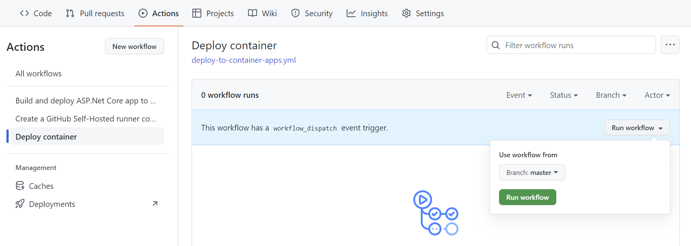

- ワークフローが正常に完了することを確認

  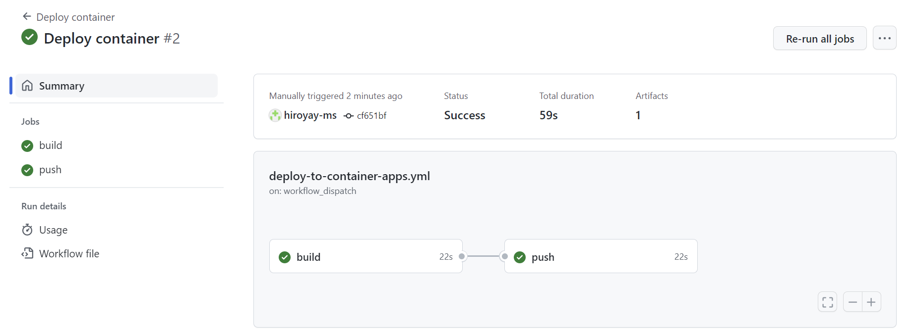

- Azure ポータルにアクセスし Azure Container Registry の管理ブレードへ移動

- "**リポジトリ**" を選択

  

- "**app**" をクリックし、イメージがアップロードされていることを確認

  

<br />

### Task 5: Container Apps の作成

- Web ブラウザで Azure ポータルにアクセスし "**作成**" をクリック

  

- 左のメニューで "**コンテナー**" を選択、コンテナー アプリの "**作成**" をクリック

  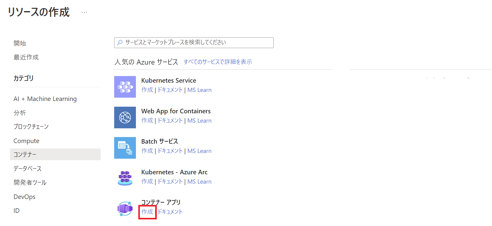

- Container Apps の作成

  - "**基本**"

    - プロジェクトの詳細

      - **サブスクリプション**: ワークショップで使用中のサブスクリプション

      - **リソース グループ**: 展開先のリソース グループ

      - **コンテナー アプリ名**: 任意 (小文字の英数字、ハイフンを使用可で 32 文字以下)

    - Container Apps 環境

      - **地域**: リソース グループと同じ地域を選択

      - **Container Apps 環境**: 新規作成をクリック

        - Container Apps 環境の作成

          - "**基本**"

            - **環境名**: 任意 (managementEnvironment-xxx)

            - **ゾーン冗長**: 無効

            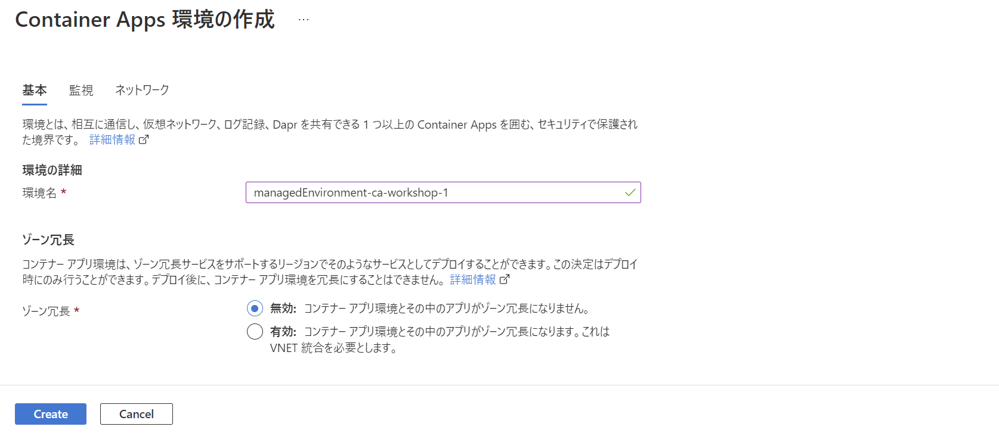

          - "**監視**"

            - **Log Analytics ワークスペース**: 新規作成

            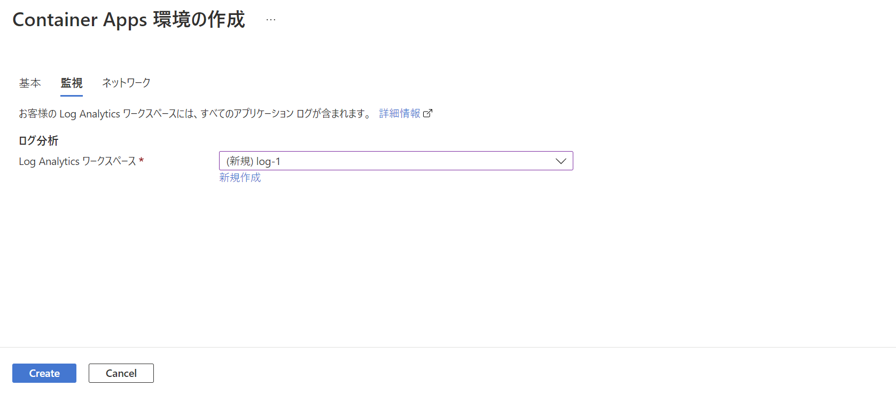

            ※ 既定の名前から変更する場合は、新規作成をクリックし名前を入力

          - "**ネットワーク**"

            - **自分の仮想ネットワークを使用する**: いいえ

            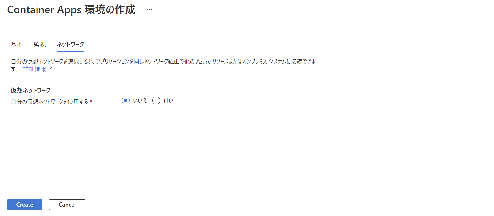

          - "**Create**" をクリックし、設定を確定

    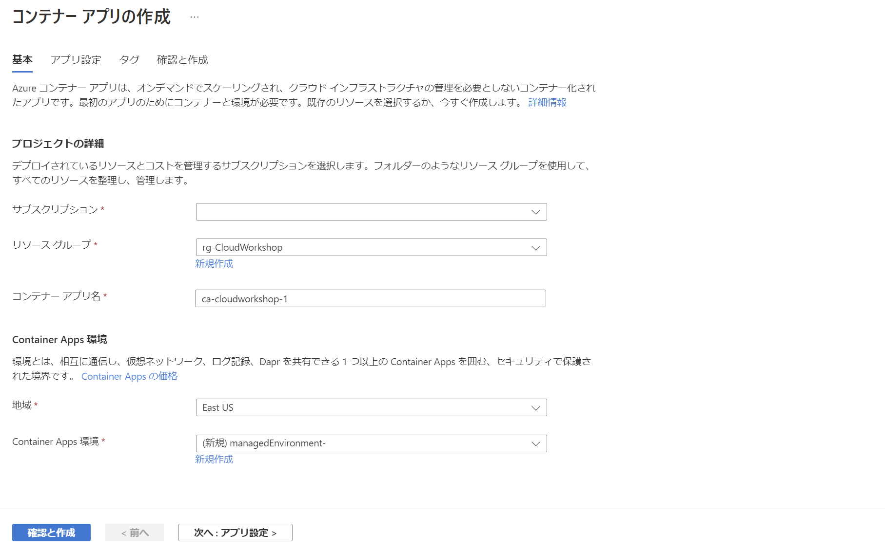

  - "**アプリ設定**"

    - **クイック スタート イメージを使用する**: オン (既定)

    - ** クイック スタート イメージ**: Simple hello world container (既定)

    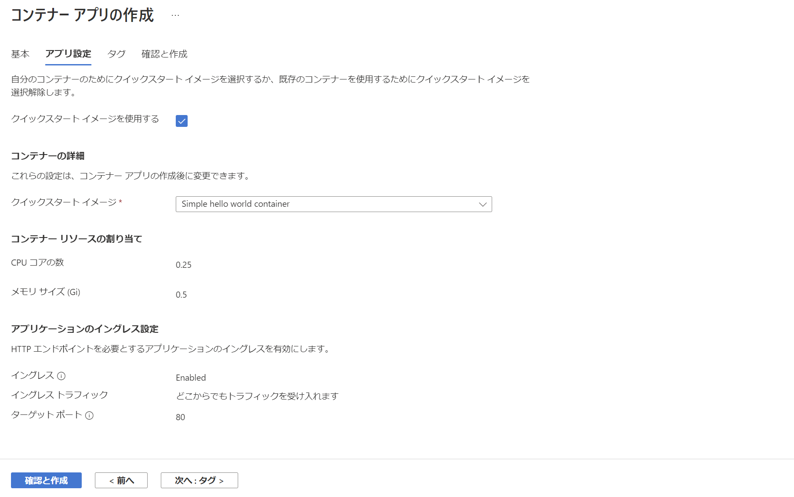

  - "**確認と作成** をクリック

  - 指定した内容を確認し "**作成**" をクリック

    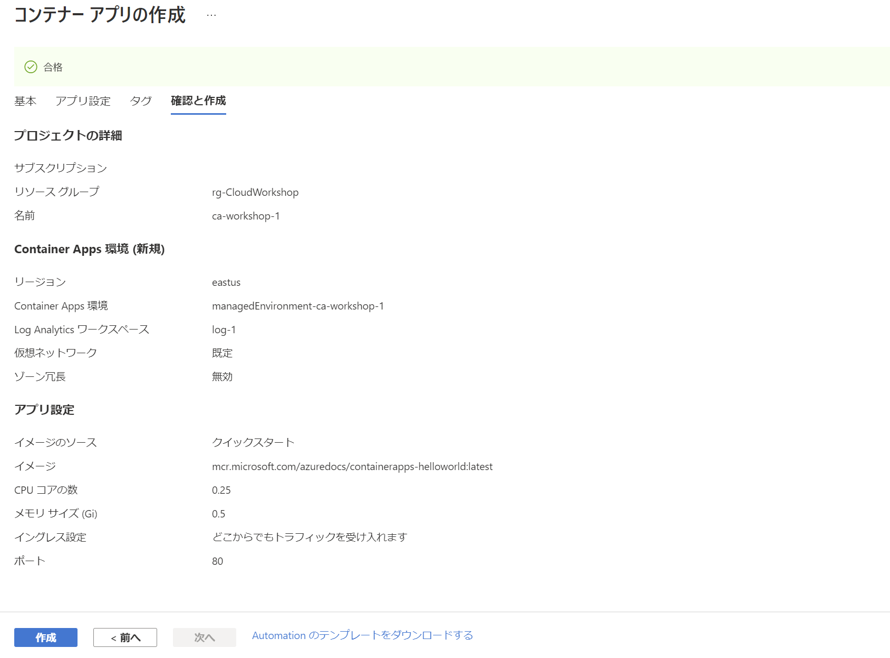

- 作成した Container Apps の管理ブレードへ移動

- "**概要**" タブの "**アプリケーション URL**" をクリック

    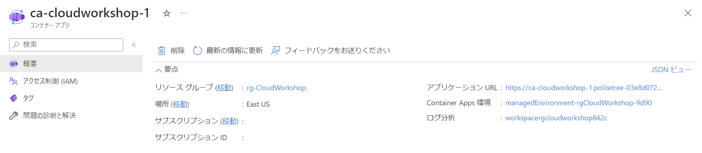

- Web ブラウザの新しいタブでアプリケーションが表示

    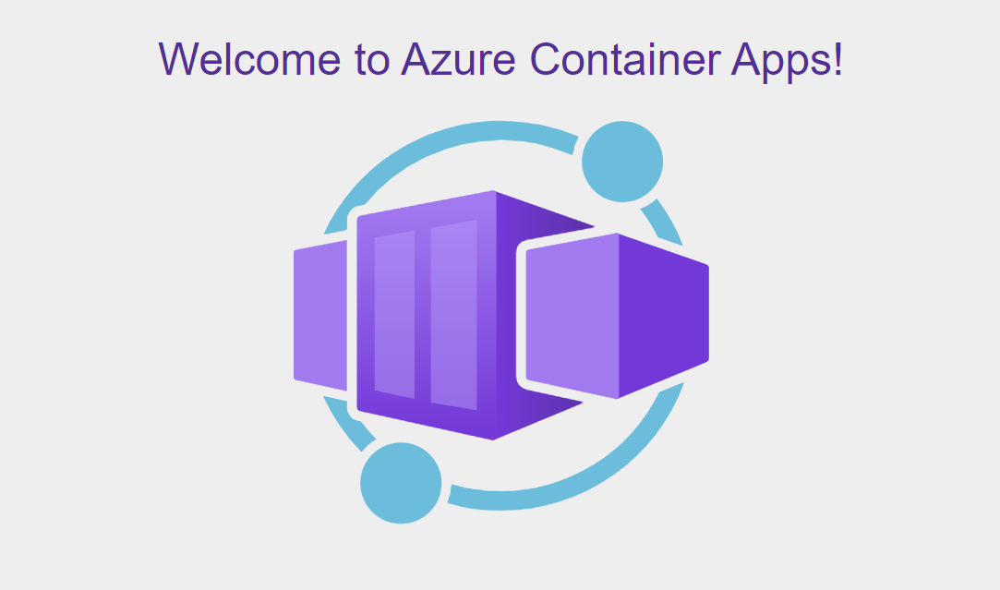

- **重要**! Java の場合は続けて SpringBoot が公開する Port:8080 をターゲットポートにして保存する

    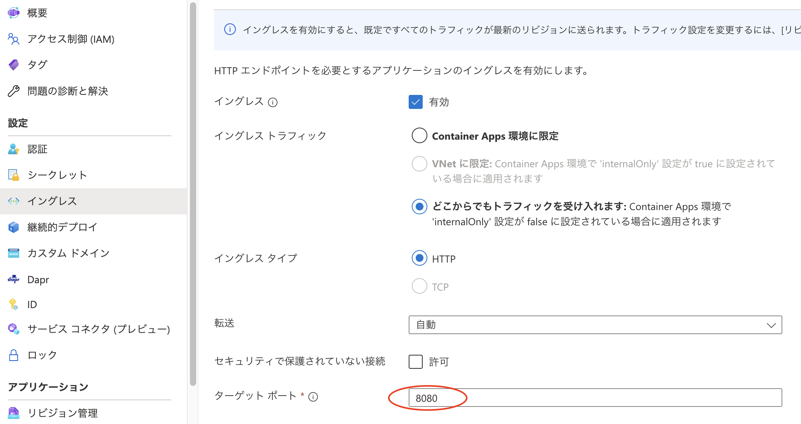

<br />

### Task 6: ワークフローの更新

- Visual Studio Code で、Task 5 で追加したワークフロー ファイルを選択

- ワークフロー実行時に値を入力できるようパラメーターを workflow_dispatch へ追加

  ```
      inputs:
        resourceGroup:
          description: 'リソース グループ名'
          required: true
          type: string
        containerApp:
          description: 'コンテナー アプリ名'
          required: true
          type: string

  ```

- Container Apps へアプリを展開するジョブを追加

  ```
    deploy:
      runs-on: ubuntu-latest
      needs: push

      steps:
        - name: Azure Login
          uses: azure/login@v1
          with:
            creds: ${{ secrets.AZURE_CREDENTIALS }}

        - name: Deploy to containerapp
          uses: azure/CLI@v1
          with:
            inlineScript: |
              az config set extension.use_dynamic_install=yes_without_prompt
              az containerapp registry set -n ${{ github.event.inputs.containerApp }} -g ${{ github.event.inputs.resourceGroup }} --server ${{ secrets.REGISTRY_LOGINSERVER }} --username  ${{ secrets.REGISTRY_USERNAME }} --password ${{ secrets.REGISTRY_PASSWORD }}
              az containerapp update -n ${{ github.event.inputs.containerApp }} -g ${{ github.event.inputs.resourceGroup }} --image ${{ secrets.REGISTRY_LOGINSERVER }}/app:${{ github.sha }}

  ```

  ※ Azure CLI を使用しアプリを展開

  <details>
  <summary>C#: ワークフロー全体</summary>

  ```
  name: Deploy container

  on:
    workflow_dispatch:
      inputs:
        resourceGroup:
          description: 'リソース グループ名'
          required: true
          type: string
        containerApp:
          description: 'コンテナー アプリ名'
          required: true
          type: string

  jobs:
    build:
      runs-on: ubuntu-latest
      env:
        APP_PATH: './src/CS'

      steps:
        - uses: actions/checkout@v2

        - name: Set up .NET Core
          uses: actions/setup-dotnet@v1
          with:
            dotnet-version: '6.0.x'
            include-prerelease: true

        - name: Build with dotnet
          run: dotnet build ${{ env.APP_PATH }} --configuration Release

        - name: dotnet publish
          run: dotnet publish ${{ env.APP_PATH }} -c Release -o ${{ env.APP_PATH }}/myapp

        - name: Upload artifact for deployment job
          uses: actions/upload-artifact@v2
          with:
            name: .net-app
            path: ${{ env.APP_PATH }}/myapp

    push:
      runs-on: ubuntu-latest
      needs: build

      steps:
        - uses: actions/checkout@v2

        - name: Download artifact from build job
          uses: actions/download-artifact@v2
          with:
            name: .net-app
            path: release

        - name: Login via Azure Container Registry
          uses: azure/docker-login@v1
          with:
            login-server: ${{ secrets.REGISTRY_LOGINSERVER }}
            username: ${{ secrets.REGISTRY_USERNAME }}
            password: ${{ secrets.REGISTRY_PASSWORD }}

        - name: Docker build and push
          run: |
            docker build . -t ${{ secrets.REGISTRY_LOGINSERVER }}/app:${{ github.sha }} -f ./.docker/CS/dockerfile
            docker push ${{ secrets.REGISTRY_LOGINSERVER }}/app:${{ github.sha }}

    deploy:
      runs-on: ubuntu-latest
      needs: push

      steps:
        - name: Azure Login
          uses: azure/login@v1
          with:
            creds: ${{ secrets.AZURE_CREDENTIALS }}

        - name: Deploy to containerapp
          uses: azure/CLI@v1
          with:
            inlineScript: |
              az config set extension.use_dynamic_install=yes_without_prompt
              az containerapp registry set -n ${{ github.event.inputs.containerApp }} -g ${{ github.event.inputs.resourceGroup }} --server ${{ secrets.REGISTRY_LOGINSERVER }} --username  ${{ secrets.REGISTRY_USERNAME }} --password ${{ secrets.REGISTRY_PASSWORD }}
              az containerapp update -n ${{ github.event.inputs.containerApp }} -g ${{ github.event.inputs.resourceGroup }} --image ${{ secrets.REGISTRY_LOGINSERVER }}/app:${{ github.sha }}

  ```

  </details>

  <details>
  <summary>Java: ワークフロー全体</summary>

  ```yml
  name: Deploy container

  on:
    workflow_dispatch:
      inputs:
        resourceGroup:
          description: "リソース グループ名"
          required: true
          type: string
        containerApp:
          description: "コンテナー アプリ名"
          required: true
          type: string

  jobs:
    build:
      runs-on: ubuntu-latest
      env:
        APP_PATH: "src/Java/webapp-java"

      steps:
        - uses: actions/checkout@v2

        - name: Set up Java version
          uses: actions/setup-java@v1
          with:
            java-version: "17"

        - name: Build with Maven
          run: |
            cd ${{ env.APP_PATH }}
            mvn clean install package

        - name: Upload artifact for deployment job
          uses: actions/upload-artifact@v3
          with:
            name: java-app
            path: "${{ github.workspace }}/${{ env.APP_PATH }}/target/*.jar"

    push:
      runs-on: ubuntu-latest
      needs: build

      steps:
        - uses: actions/checkout@v2

        - name: Download artifact from build job
          uses: actions/download-artifact@v3
          with:
            name: java-app
            path: "target"

        - name: Login via Azure Container Registry
          uses: azure/docker-login@v1
          with:
            login-server: ${{ secrets.REGISTRY_LOGINSERVER }}
            username: ${{ secrets.REGISTRY_USERNAME }}
            password: ${{ secrets.REGISTRY_PASSWORD }}

        - name: Docker build and push
          run: |
            docker build . -t ${{ secrets.REGISTRY_LOGINSERVER }}/app:${{ github.sha }} -f ./.docker/Java/dockerfile
            docker push ${{ secrets.REGISTRY_LOGINSERVER }}/app:${{ github.sha }}

    deploy:
      runs-on: ubuntu-latest
      needs: push

      steps:
        - name: Azure Login
          uses: azure/login@v1
          with:
            creds: ${{ secrets.AZURE_CREDENTIALS }}

        - name: Deploy to containerapp
          uses: azure/CLI@v1
          with:
            inlineScript: |
              az config set extension.use_dynamic_install=yes_without_prompt
              az containerapp registry set -n ${{ github.event.inputs.containerApp }} -g ${{ github.event.inputs.resourceGroup }} --server ${{ secrets.REGISTRY_LOGINSERVER }} --username  ${{ secrets.REGISTRY_USERNAME }} --password ${{ secrets.REGISTRY_PASSWORD }}
              az containerapp update -n ${{ github.event.inputs.containerApp }} -g ${{ github.event.inputs.resourceGroup }} --image ${{ secrets.REGISTRY_LOGINSERVER }}/app:${{ github.sha }}
  ```

  </details>

- ワークフロー ファイル更新後、ローカル Git にコミットを行い、リモート リポジトリへプッシュを実行

<br />

### Task 7: ワークフローの実行

- Web ブラウザで GitHub リポジトリへアクセス、"**Actions**" タブを選択

- Container Apps へアプリを展開するワークフローを選択

- 展開先のリソース グループ、Container Apps の名前を入力し "**Run workflow**" をクリック

  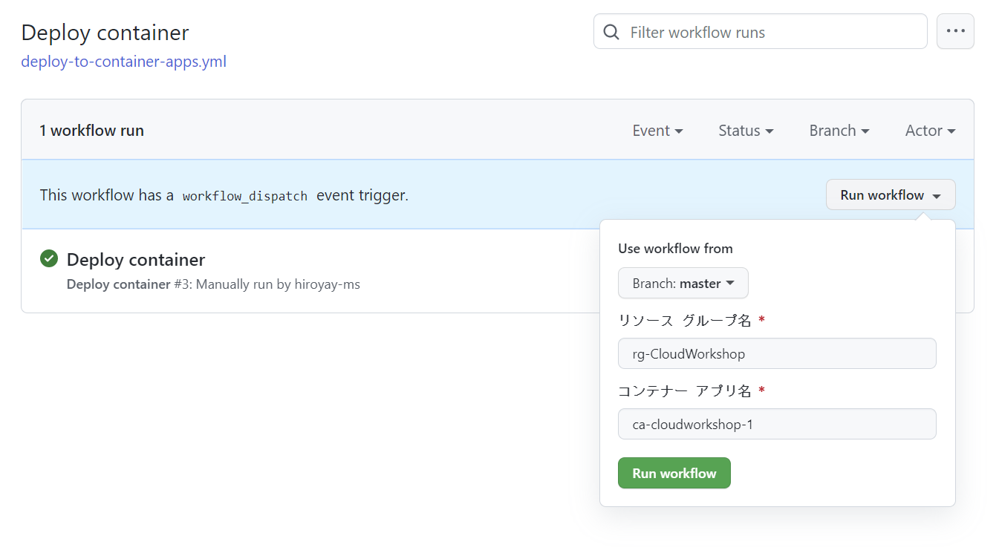

- ワークフローが正常に完了したことを確認

  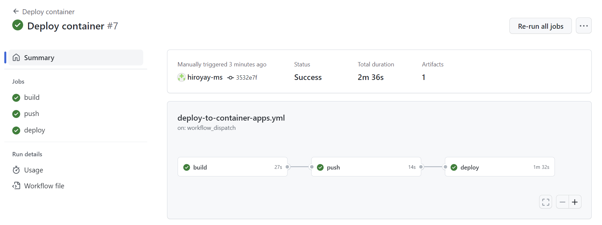

- 作成した Container Apps の管理ブレードへ移動

- "**概要**" タブの "**アプリケーション URL**" をクリック

    

- Web ブラウザの新しいタブでアプリケーションが表示されることを確認

<br />

## Exercise 5: GitHub Actions による Azure リソースの展開

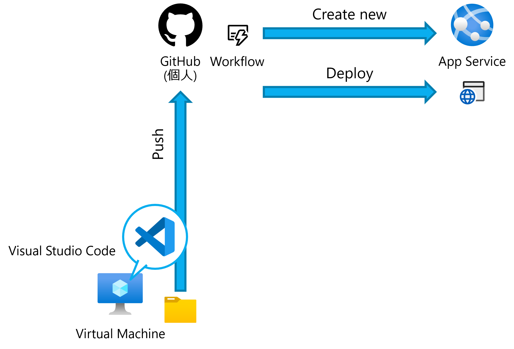

### Task 1: ARM テンプレートの作成

- Visual Studio Code のサイドバーで "**Explorer** を選択

- templates 配下に "**app-service.json**" の名前でファイルを作成

　※ templates フォルダが存在しない場合は作成してからファイルを追加

  

- エディタで作成したファイルが開くため編集

- "**arm** と入力すると候補が表示されるため "**arm!**" を選択

  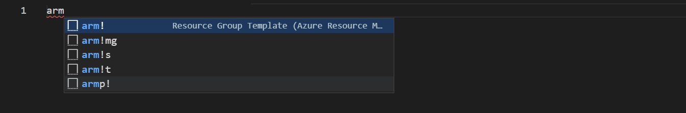

- ARM テンプレートの雛形が展開

  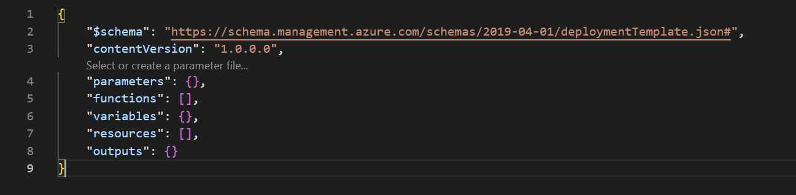

- "**parameters**" フィールドの {} の内で Enter キーを押下

  「**"**(ダブルコーテーション)」 を入力すると候補が表示されるため "**new-parameter** を選択

  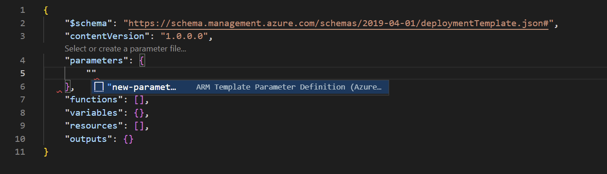

- パラメーター定義の雛形が展開

  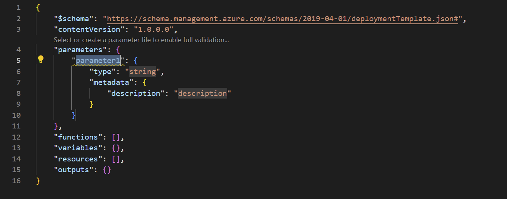

- 名前, type, description を入力し、パラメーターを定義

  - 名前: appName

  - type: string

  - description: アプリケーションの名前

  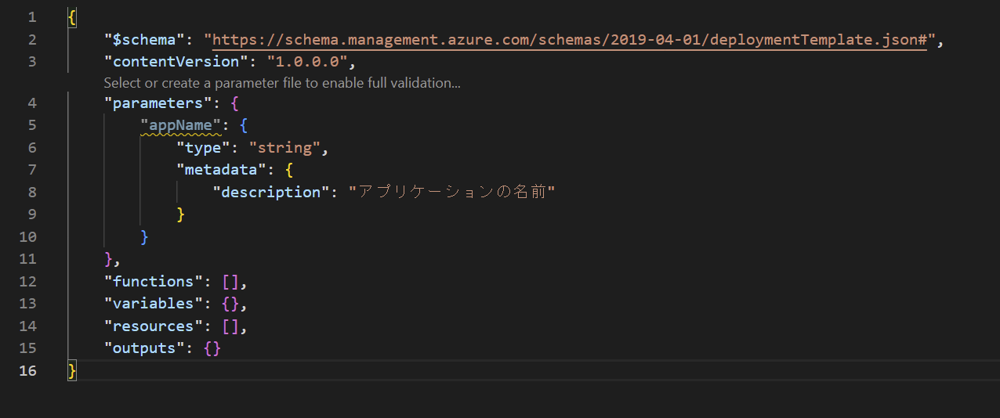

- "**variables**" フィールドの {} の内で Enter キーを押下

  「**"**(ダブルコーテーション)」 を入力すると候補が表示されるため "**new-variable** を選択

  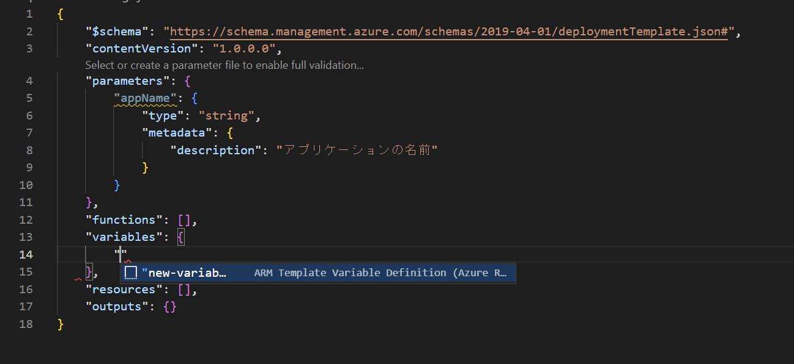

- 変数定義の雛形が展開

  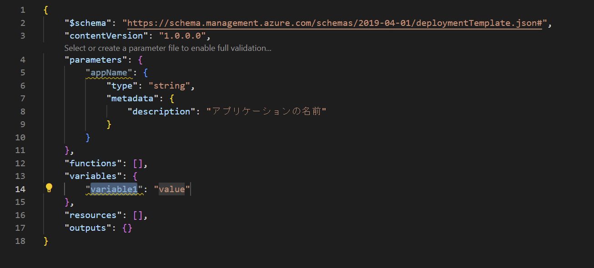

- 名前と値を入力し、変数を定義

  - 名前: appServicePlan

  - 値: [concat('asp-', parameters('appName'))]

  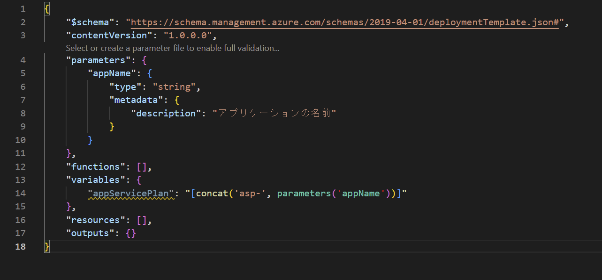

  ※ パラメーターで指定された値に "**asp-**" の接頭語を付与

- ２つめの変数を追加

  ```
  "appService": "[concat('app-', parameters('appName'))]"
  ```

  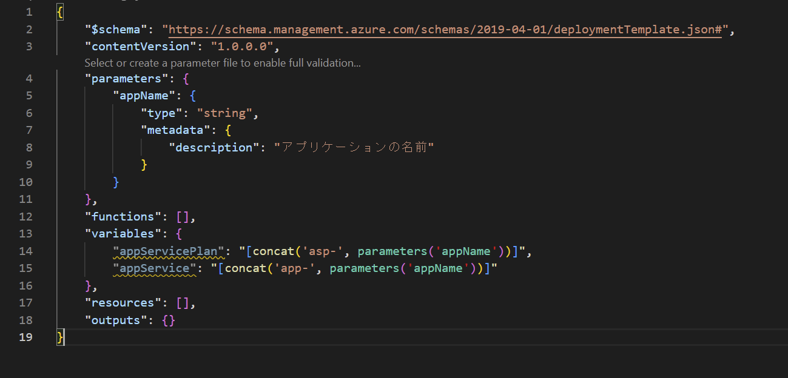

  ※ パラメーターで指定された値に "**app-**" の接頭語を付与

- "**resources**" フィールドの [] の内で Enter キーを押下

  "**{**" を入力すると候補が表示されるため "**type** を選択

  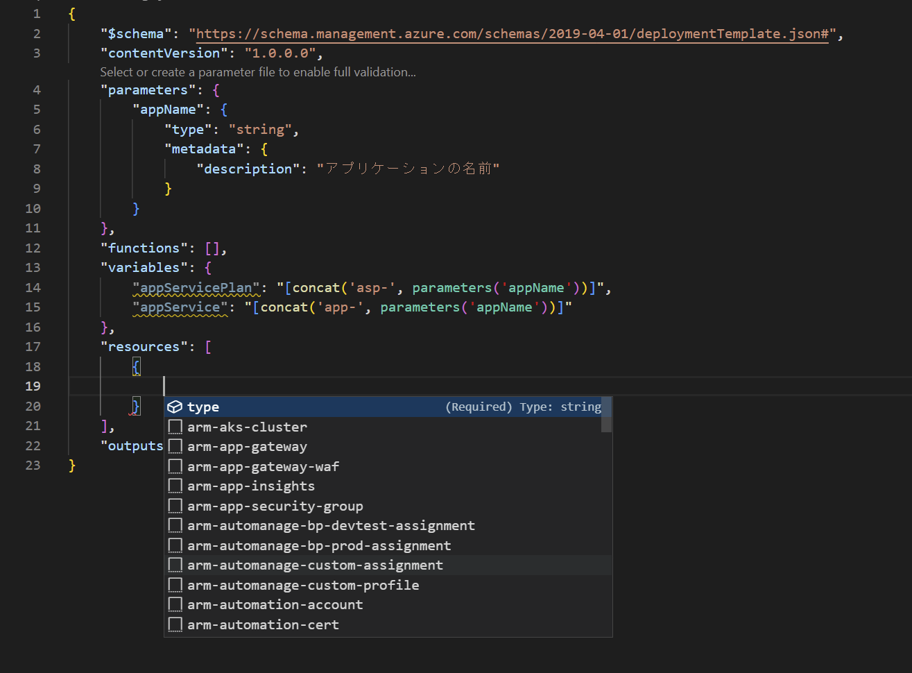

  ※ インテリセンスにより展開するリソースを候補から選択可

  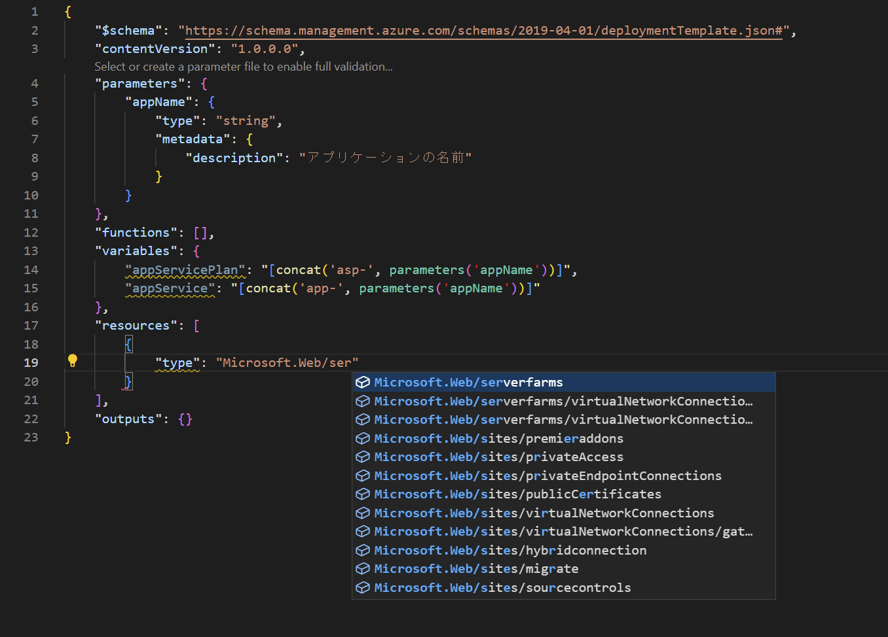

- 展開する App Service Plan の定義を {} 内に記述

  <details>
  <summary>C#</summary>

  ```yml
              "type": "Microsoft.Web/serverfarms",
              "apiVersion": "2022-03-01",
              "name": "[variables('appServicePlan')]",
              "location": "[resourceGroup().location]",
              "sku": {
                  "name": "S1",
                  "tier": "Standard"
              }
  ```

  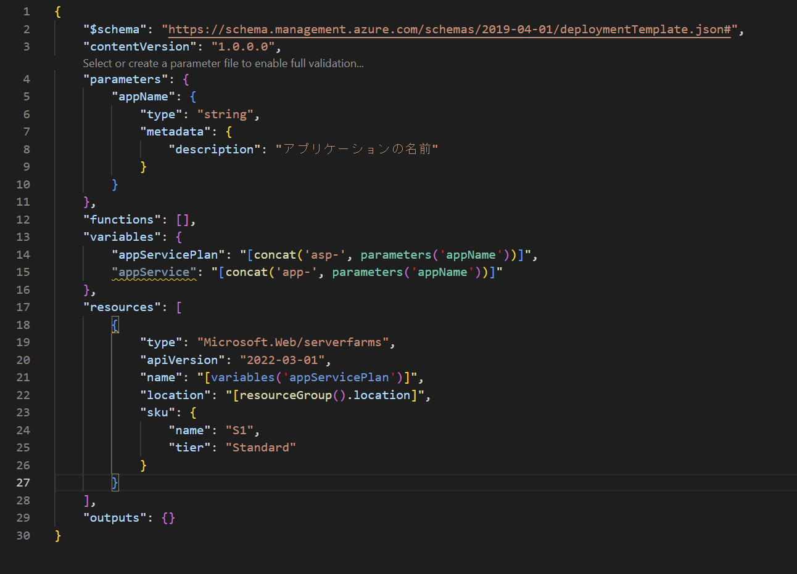

  </details>

  <details>
  <summary>Java</summary>

  ```yml
            "type": "Microsoft.Web/serverfarms",
            "apiVersion": "2022-03-01",
            "name": "[variables('appServicePlan')]",
            "location": "[resourceGroup().location]",
            "kind": "linux",
            "sku": {
                "name": "S1",
                "tier": "Standard"
            },
            "properties": {
                "reserved": true
            }
  ```

  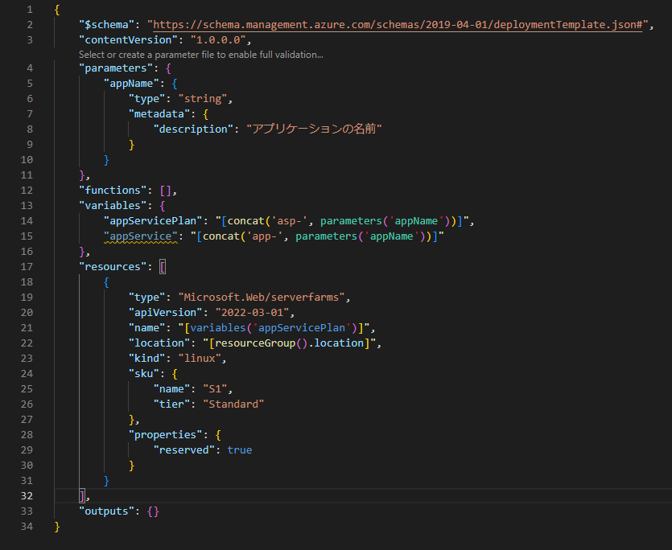

  </details>

<br />

- App Service の定義を App Service Plan の下に追加

  <details>
  <summary>C#</summary>

  ```yml
  {
    "type": "Microsoft.Web/sites",
    "apiVersion": "2022-03-01",
    "name": "[variables('appService')]",
    "location": "[resourceGroup().location]",
    "dependsOn":
      [
        "[resourceId('Microsoft.Web/serverfarms', variables('appServicePlan'))]",
      ],
    "properties":
      {
        "siteConfig":
          {
            "metadata": [{ "name": "CURRENT_STACK", "value": "dotnet" }],
            "netFrameworkVersion": "v6.0",
          },
        "serverFarmId": "[resourceId('Microsoft.Web/serverfarms', variables('appServicePlan'))]",
        "httpsOnly": true,
      },
  }
  ```

  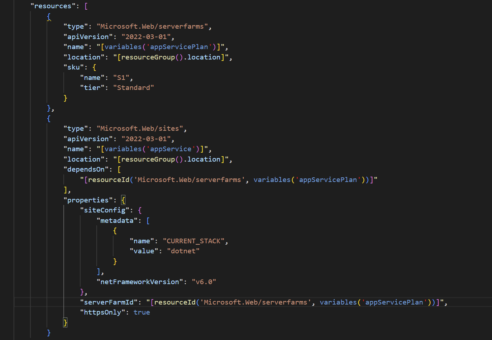

  </details>

  <details>
  <summary>Java</summary>

  ```yml
  {
    "type": "Microsoft.Web/sites",
    "apiVersion": "2022-03-01",
    "name": "[variables('appService')]",
    "location": "[resourceGroup().location]",
    "dependsOn":
      [
        "[resourceId('Microsoft.Web/serverfarms', variables('appServicePlan'))]",
      ],
    "kind": "app,linux",
    "properties":
      {
        "siteConfig": { "linuxFxVersion": "JAVA|17-java17" },
        "serverFarmId": "[resourceId('Microsoft.Web/serverfarms', variables('appServicePlan'))]",
        "httpsOnly": true,
      },
  }
  ```

  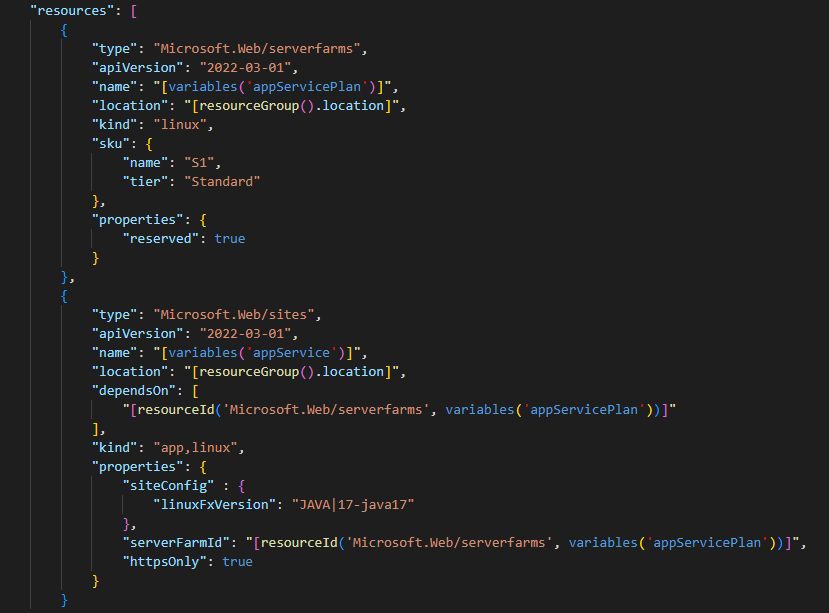

  </details>

<br />

- ARM テンプレート全文
  <details>
  <summary>C#</summary>

  ```yml
  {
    "$schema": "https://schema.management.azure.com/schemas/2019-04-01/deploymentTemplate.json#",
    "contentVersion": "1.0.0.0",
    "parameters":
      {
        "appName":
          {
            "type": "string",
            "metadata":
              {
                "description": "Web アプリ名 (App Service には app-, Plan には asp- の接頭語が付きます)",
              },
          },
      },
    "functions": [],
    "variables":
      {
        "appServicePlan": "[concat('asp-', parameters('appName'))]",
        "appService": "[concat('app-', parameters('appName'))]",
      },
    "resources":
      [
        {
          "type": "Microsoft.Web/serverfarms",
          "apiVersion": "2022-03-01",
          "name": "[variables('appServicePlan')]",
          "location": "[resourceGroup().location]",
          "sku": { "name": "S1", "tier": "Standard" },
        },
        {
          "type": "Microsoft.Web/sites",
          "apiVersion": "2022-03-01",
          "name": "[variables('appService')]",
          "location": "[resourceGroup().location]",
          "dependsOn":
            [
              "[resourceId('Microsoft.Web/serverfarms', variables('appServicePlan'))]",
            ],
          "properties":
            {
              "siteConfig":
                {
                  "metadata": [{ "name": "CURRENT_STACK", "value": "dotnet" }],
                  "netFrameworkVersion": "v6.0",
                },
              "serverFarmId": "[resourceId('Microsoft.Web/serverfarms', variables('appServicePlan'))]",
              "httpsOnly": true,
            },
        },
      ],
    "outputs": {},
  }
  ```

  </details>

  <details>
  <summary>Java</summary>

  ```yml
  {
    "$schema": "https://schema.management.azure.com/schemas/2019-04-01/deploymentTemplate.json#",
    "contentVersion": "1.0.0.0",
    "parameters":
      {
        "appName":
          {
            "type": "string",
            "metadata": { "description": "アプリケーションの名前" },
          },
      },
    "functions": [],
    "variables":
      {
        "appServicePlan": "[concat('asp-', parameters('appName'))]",
        "appService": "[concat('app-', parameters('appName'))]",
      },
    "resources":
      [
        {
          "type": "Microsoft.Web/serverfarms",
          "apiVersion": "2022-03-01",
          "name": "[variables('appServicePlan')]",
          "location": "[resourceGroup().location]",
          "kind": "linux",
          "sku": { "name": "S1", "tier": "Standard" },
          "properties": { "reserved": true },
        },
        {
          "type": "Microsoft.Web/sites",
          "apiVersion": "2022-03-01",
          "name": "[variables('appService')]",
          "location": "[resourceGroup().location]",
          "dependsOn":
            [
              "[resourceId('Microsoft.Web/serverfarms', variables('appServicePlan'))]",
            ],
          "kind": "app,linux",
          "properties":
            {
              "siteConfig": { "linuxFxVersion": "JAVA|17-java17" },
              "serverFarmId": "[resourceId('Microsoft.Web/serverfarms', variables('appServicePlan'))]",
              "httpsOnly": true,
            },
        },
      ],
    "outputs": {},
  }
  ```

  </details>

<br />

### Task 2: パラメーター ファイルの追加

- "**Select or create a parameter file to enable full validation...**" をクリック

  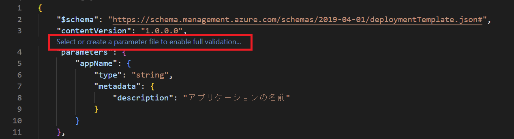

- "**New...**" を選択

  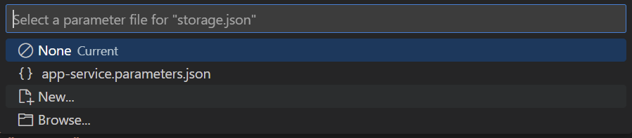

- "**All parameters**" を選択

  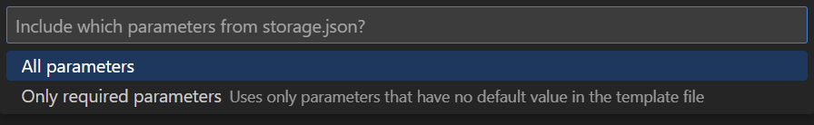

- 既定の名前でファイルを作成

  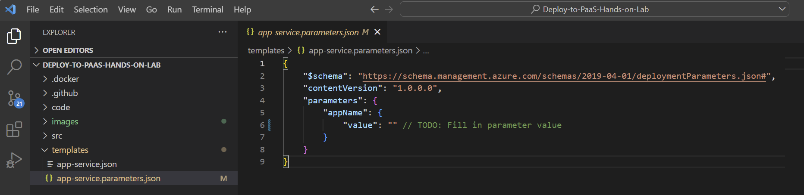

  ※ テンプレート ファイルと同じ場所に <テンプレート ファイル名>.parameters.json の名前でファイルを生成

- コメントを削除し "**value**" に値を入力

  ※ App Service の名前となるので、グローバルで一意となる値を入力（テンプレートの設定で接頭語に app- が付与）

  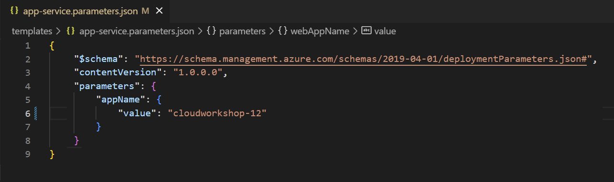

<br />

### Task 3: ワークフローの作成

- **.github/workflows** に新しいワークフロー ファイル (.yml) を追加

  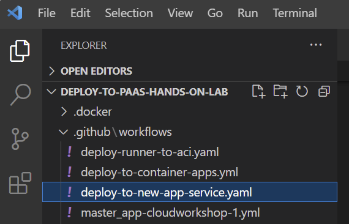

- ワークフロー名とトリガー条件を記述

  ```yml
  name: Deploy new App Service

  on:
    workflow_dispatch:
      inputs:
        resourceGroup:
          description: "リソース グループ名"
          required: true
          type: string
  ```

  ※ ワークフローは手動で実行、実行時にリソース グループ名をパラメーターとして取得

- リソースを展開するジョブを追加

  ```yml
  jobs:
    add-resource:
      runs-on: ubuntu-latest

      steps:
        - uses: actions/checkout@v2

        - uses: azure/login@v1
          with:
            creds: ${{ secrets.AZURE_CREDENTIALS }}

        - name: ARM deploy
          uses: azure/arm-deploy@v1
          with:
            subscriptionId: ${{ secrets.AZURE_SUBSCRIPTION }}
            resourceGroupName: ${{ github.event.inputs.resourceGroup }}
            template: ./templates/app-service.json
            parameters: ./templates/app-service.parameters.json
  ```

  <details>
  <summary>ワークフロー全文</summary>

  ```
  name: Deploy new App Service

  on:
    workflow_dispatch:
      inputs:
        resourceGroup:
          description: 'リソース グループ名'
          required: true
          type: string

  jobs:
    add-resource:
      runs-on: ubuntu-latest

      steps:
        - uses: actions/checkout@v2

        - uses: azure/login@v1
          with:
            creds: ${{ secrets.AZURE_CREDENTIALS }}

        - name: ARM deploy
          uses: azure/arm-deploy@v1
          with:
            subscriptionId: ${{ secrets.AZURE_SUBSCRIPTION }}
            resourceGroupName: ${{ github.event.inputs.resourceGroup }}
            template: ./templates/app-service.json
            parameters: ./templates/app-service.parameters.json

  ```

  </details>

- ワークフロー ファイル作成後、ローカル Git にコミットを行い、リモート リポジトリへプッシュを実行

<br />

### Task 4: ワークフローの検証

- Web ブラウザで GitHub リポジトリへアクセス、"**Actions**" タブを選択

- App Service を展開するワークフローを選択

- 展開先のリソース グループの名前を入力し "**Run workflow**" をクリック

  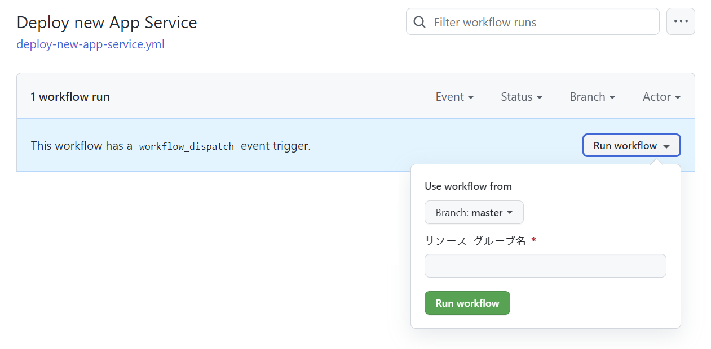

- ワークフローが正常に完了することを確認

  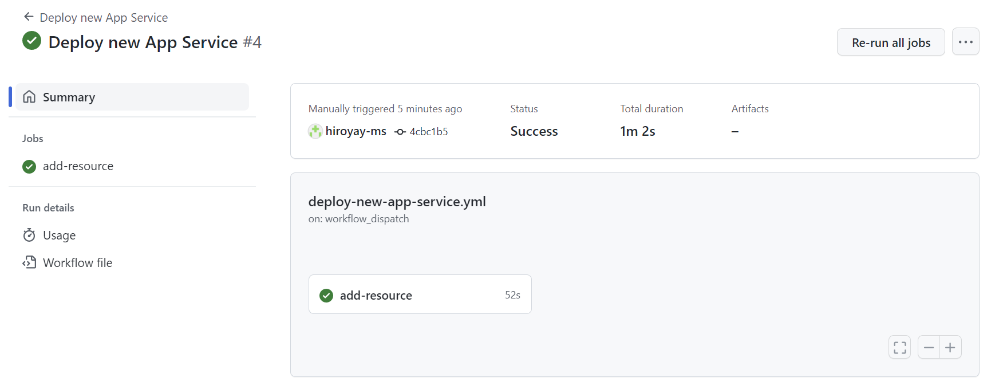

- Azure ポータルにアクセスし、指定したリソース グループ内に App Service が作成されていることを確認

<br />

### Task 5: アプリケーションのビルドと新しいリソースへの展開

- Visual Studio Code のサイドバーで "**Explorer** を選択

- App Service へアプリを展開するワークフロー ファイルを選択

- ワークフロー ファイルの編集

  - workflow_dispatch トリガーにパラメーターを 2 つ追加

    ```yml
    inputs:
      deploy-new-resouce:
        description: "新しい App Service を展開"
        type: boolean
      resourceGroup:
        description: "リソース グループ"
        type: string
      appService:
        description: "アプリケーション名"
        type: string
    ```

    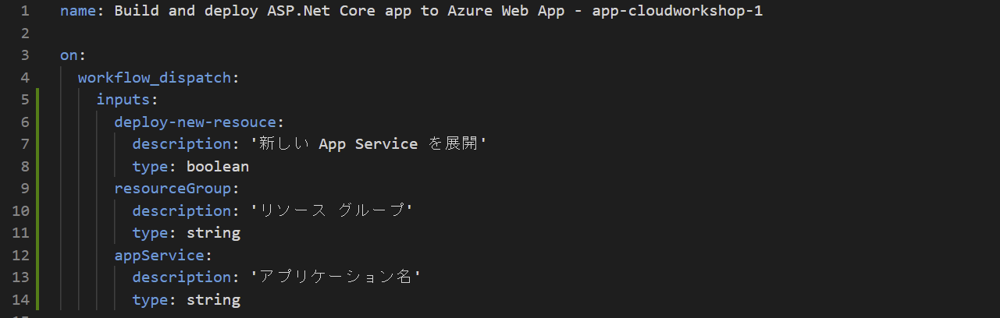

  - 新しい App Service を展開するジョブを修正

    ```yml
    add-resource:
      if: ${{ github.event.inputs.deploy-new-resouce == 'true' }}
      runs-on: ubuntu-latest

      steps:
        - uses: actions/checkout@v2

        - uses: azure/login@v1
          with:
            creds: ${{ secrets.AZURE_CREDENTIALS }}

        - name: ARM deploy
          uses: azure/arm-deploy@v1
          with:
            subscriptionId: ${{ secrets.AZURE_SUBSCRIPTION }}
            resourceGroupName: ${{ github.event.inputs.resourceGroup }}
            template: ./templates/app-service.json
            parameters: appName=${{ github.event.inputs.appService }}
    ```

    ※ if 文を追加。'新しい App Service を展開' のパラメーターが true のときのみ実行

    ※ App Service 名は、パラメーター ファイルでなく、ワークフロー実行時に入力された値を使用するように変更

    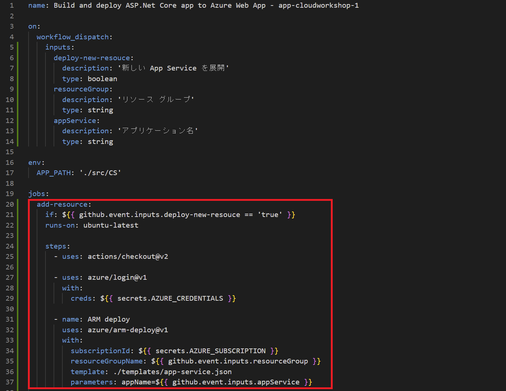

  - 全体で次のような構成になるように ステップを追加する

    - Exe2 で使用した yaml ファイルから、build と deploy ステップを add-resource ステップの下にコピー
    - Exe2 で使用した yaml ファイルから環境変数の APP_PATH 設定をコピー

    ```yml
    jobs:
      on: ・・・
      env:
        APP_PATH: "・・・"
      jobs:
        add-resource: ・・・
        build: ・・・
        deploy: ・・・
    ```

  - deploy ジョブの変更

    ```yml
    if: ${{ github.event.inputs.deploy-new-resouce == 'false' }}
    ```

    ※ '新しい App Service を展開' のパラメーターが false のときのみ実行

    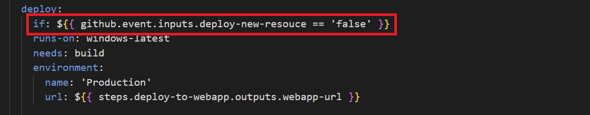

  - 新しい App Service へアプリを展開するジョブを追加

    <details>
    <summary>C#</summary>

    ```yml
    deploy-to-new-resource:
      if: ${{ github.event.inputs.deploy-new-resouce == 'true' }}
      runs-on: windows-latest
      needs: [add-resource, build]

      steps:
        - uses: azure/login@v1
          with:
            creds: ${{ secrets.AZURE_CREDENTIALS }}

        - name: Download artifact from build jobs
          uses: actions/download-artifact@v2
          with:
            name: .net-app

        - name: Deploy to Web app
          id: deploy-to-webAppName
          uses: azure/webapps-deploy@v2
          with:
            app-name: "app-${{ github.event.inputs.appService }}"
            slot-name: "Production"
            package: .
    ```

    </details>

    <details>
    <summary>Java</summary>

    ```yml
    deploy-to-new-resource:
      if: ${{ github.event.inputs.deploy-new-resouce == 'true' }}
      runs-on: ubuntu-latest
      needs: [add-resource, build]

      steps:
        - uses: azure/login@v1
          with:
            creds: ${{ secrets.AZURE_CREDENTIALS }}

        - name: Download artifact from build jobs
          uses: actions/download-artifact@v3
          with:
            name: java-app

        - name: Deploy to Web app
          id: deploy-to-webAppName
          uses: azure/webapps-deploy@v2
          with:
            app-name: "app-${{ github.event.inputs.appService }}"
            slot-name: "Production"
            package: "*.jar"
    ```

    </details>

    ※ アプリの展開はサービス プリンシパルで実行

    - ワークフロー全文
      <details>
      <summary>C#</summary>

      ```yml
      name: Build and deploy ASP.Net Core app to Azure Web App - app-cloudworkshop-1

      on:
        workflow_dispatch:
          inputs:
            deploy-new-resouce:
              description: "新しい App Service を展開"
              type: boolean
            resourceGroup:
              description: "リソース グループ"
              type: string
            appService:
              description: "アプリケーション名"
              type: string

      env:
        APP_PATH: "./src/CS"

      jobs:
        add-resource:
          if: ${{ github.event.inputs.deploy-new-resouce == 'true' }}
          runs-on: ubuntu-latest

          steps:
            - uses: actions/checkout@v2

            - uses: azure/login@v1
              with:
                creds: ${{ secrets.AZURE_CREDENTIALS }}

            - name: ARM deploy
              uses: azure/arm-deploy@v1
              with:
                subscriptionId: ${{ secrets.AZURE_SUBSCRIPTION }}
                resourceGroupName: ${{ github.event.inputs.resourceGroup }}
                template: ./templates/app-service.json
                parameters: appName=${{ github.event.inputs.appService }}

        build:
          runs-on: windows-latest

          steps:
            - uses: actions/checkout@v2

            - name: Set up .NET Core
              uses: actions/setup-dotnet@v1
              with:
                dotnet-version: "6.0.x"
                include-prerelease: true

            - name: Build with dotnet
              run: dotnet build ${{ env.APP_PATH }} --configuration Release

            - name: dotnet publish
              run: dotnet publish ${{ env.APP_PATH }} -c Release -o ${{ env.APP_PATH }}/myapp

            - name: Upload artifact for deployment job
              uses: actions/upload-artifact@v2
              with:
                name: .net-app
                path: ${{ env.APP_PATH }}/myapp

        deploy:
          if: ${{ github.event.inputs.deploy-new-resouce == 'false' }}
          runs-on: windows-latest
          needs: build
          environment:
            name: "Production"
            url: ${{ steps.deploy-to-webapp.outputs.webapp-url }}

          steps:
            - name: Download artifact from build job
              uses: actions/download-artifact@v2
              with:
                name: .net-app

            - name: Deploy to Azure Web App
              id: deploy-to-webapp
              uses: azure/webapps-deploy@v2
              with:
                app-name: "app-cloudworkshop-1"
                slot-name: "staging"
                publish-profile: ${{ secrets.AZUREAPPSERVICE_PUBLISHPROFILE_xxxx }}
                package: .

        deploy-to-new-resource:
          if: ${{ github.event.inputs.deploy-new-resouce == 'true' }}
          runs-on: windows-latest
          needs: [add-resource, build]

          steps:
            - uses: azure/login@v1
              with:
                creds: ${{ secrets.AZURE_CREDENTIALS }}

            - name: Download artifact from build jobs
              uses: actions/download-artifact@v2
              with:
                name: .net-app

            - name: Deploy to Web app
              id: deploy-to-webAppName
              uses: azure/webapps-deploy@v2
              with:
                app-name: "app-${{ github.event.inputs.appService }}"
                slot-name: "Production"
                package: .
      ```

      </details>

      <details>
      <summary>Java</summary>

      ```yml
      name: Deploy new App Service

      on:
        workflow_dispatch:
          inputs:
            deploy-new-resouce:
              description: "新しい App Service を展開"
              type: boolean
            resourceGroup:
              description: "リソース グループ名"
              required: true
              type: string
            appService:
              description: "アプリケーション名"
              type: string

      env:
        APP_PATH: "src/Java/webapp-java"

      jobs:
        add-resource:
          if: ${{ github.event.inputs.deploy-new-resouce == 'true' }}
          runs-on: ubuntu-latest

          steps:
            - uses: actions/checkout@v2

            - uses: azure/login@v1
              with:
                creds: ${{ secrets.AZURE_CREDENTIALS }}

            - name: ARM deploy
              uses: azure/arm-deploy@v1
              with:
                subscriptionId: ${{ secrets.AZURE_SUBSCRIPTION }}
                resourceGroupName: ${{ github.event.inputs.resourceGroup }}
                template: ./templates/app-service.json
                parameters: appName=${{ github.event.inputs.appService }}

        build:
          runs-on: ubuntu-latest

          steps:
            - uses: actions/checkout@v2

            - name: Set up Java version
              uses: actions/setup-java@v1
              with:
                java-version: "17"

            - name: Build with Maven
              run: |
                cd ${{ env.APP_PATH }}
                mvn clean install

            - name: Upload artifact for deployment job
              uses: actions/upload-artifact@v3
              with:
                name: java-app
                path: "${{ github.workspace }}/${{ env.APP_PATH }}/target/*.jar"

        deploy:
          if: ${{ github.event.inputs.deploy-new-resouce == 'false' }}
          runs-on: ubuntu-latest
          needs: build
          environment:
            name: "Production"
            url: ${{ steps.deploy-to-webapp.outputs.webapp-url }}

          steps:
            - name: Download artifact from build job
              uses: actions/download-artifact@v3
              with:
                name: java-app

            - name: Deploy to Azure Web App
              id: deploy-to-webapp
              uses: azure/webapps-deploy@v2
              with:
                app-name: ${{ github.event.inputs.appService }}
                slot-name: "staging"
                publish-profile: ${{ secrets.AZUREAPPSERVICE_PUBLISHPROFILE_ご自身の発行プロファイルの値 }}
                package: "*.jar"

        deploy-to-new-resource:
          if: ${{ github.event.inputs.deploy-new-resouce == 'true' }}
          runs-on: ubuntu-latest
          needs: [add-resource, build]

          steps:
            - uses: azure/login@v1
              with:
                creds: ${{ secrets.AZURE_CREDENTIALS }}

            - name: Download artifact from build jobs
              uses: actions/download-artifact@v3
              with:
                name: java-app

            - name: Deploy to Web app
              id: deploy-to-webAppName
              uses: azure/webapps-deploy@v2
              with:
                app-name: "app-${{ github.event.inputs.appService }}"
                slot-name: "Production"
                package: "*.jar"
      ```

      </details>

<br />

- ワークフロー ファイル作成後、ローカル Git にコミットを行い、リモート リポジトリへプッシュを実行

### Task 6: ワークフローの実行

- Web ブラウザで GitHub リポジトリへアクセス、"**Actions**" タブを選択

- App Service へアプリを展開するワークフローを選択

- パラメーターを入力し "**Run workflow**" をクリック

  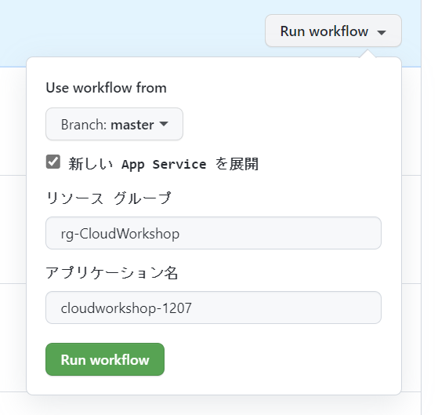

- ワークフローが正常に完了することを確認

  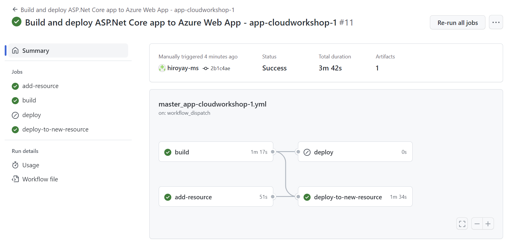

- Azure ポータルにアクセスし、指定したリソース グループ内に App Service が作成されていることを確認

- 展開した App Service の管理ブレードへ移動し URL をクリック

- 新しいタブで展開されたアプリケーションが表示されることを確認

<br />
