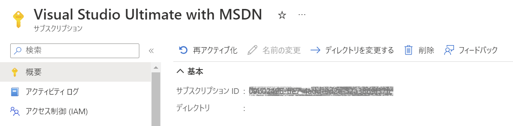

Azure PaaS CI/CD Hands-on lab  
Dec 2022

<br />

### Contents

<br />

## Exercise 1: 開発ツールから App Service への Web アプリの展開

### Task 1: リポジトリのフォーク

- Web ブラウザを起動し、"<a href="https://github.com/kohei3110/Deploy-to-PaaS-Hands-on-Lab" target="_blank">ワークショップのリポジトリ</a>" へ移動

- 画面右上の Fork をクリック

  

- 自身のアカウントにリポジトリが複製されていることを確認


<br />

### Task 2: 開発環境へのリポジトリのクローン

- Fork したリポジトリの "**Code**" をクリック

  表示されるツール チップよりリポジトリの URL をコピー

  

- Visual Studio Code を起動

- Explorer を開き "**Clone Repository" をクリック

  

- リポジトリの URL の入力を求められるためコピーした URL を貼り付け Enter キーを押下

  

- 複製先となるローカル ディレクトリを選択

  GitHub の認証情報が求められる場合は、アカウント名、パスワードを入力し認証を実施

- 複製されたリポジトリを開くかどうかのメッセージが表示されるので "**Open**" をクリック

- Explorer に複製したリポジトリのディレクトリ、ファイルが表示

  

- ローカルでアプリケーションを実行を確認

  <details>
  <summary>C#</summary>

  - "**Terminal**" - "**New Terminal**" を選択

    
  
  - C# の ASP.NET Core プロジェクトのディレクトリへ移動

    ```
    cd src/CS
    ```
  
  - アプリケーションを実行

    ```
    dotnet run
    ```
  
  - ターミナルに以下のようなメッセージが表示（Web アプリをテストする URL が https\://localhost:{port} で表示）

    HTTPS URL を Ctrl キーを押しながらクリック

    
  
  - Web ブラウザが起動し、アプリケーションを表示

    

  - ターミナルで Ctrl + C を押下してアプリケーションを終了

  </details>

  <details>
  <summary>他の言語</summary>
  
  </details>

<br />

### Task 3: App Service の作成

- Web ブラウザを起動し <a href="https://portal.azure.com/">Azure ポータル</a> へアクセス

- "**+作成** をクリック

  

- Web アプリの "**作成**" をクリック

  

- Web アプリの作成

  - "**基本**"

    - プロジェクトの詳細

      - サブスクリプション: ワークショップで使用中のサブスクリプション

      - リソース グループ: 展開先のリソース グループ

    - インスタンスの詳細

      - 名前: 一意となる名前を入力

      - 公開: コード

      - ランタイム スタック: 展開するアプリのランタイムを選択

      - オペレーティング システム: Windows

      - 地域: リソース グループと同じ地域を選択

    - App Service プラン

      - プラン: 新規作成（既定の名前で OK）

      - SKU とサイズ: Standard S1

    

  - "**デプロイ**"

    - 継続的デプロイ: 無効化

    

  - "**ネットワーク**"

    - ネットワーク インジェクションを有効にする: オフ

    

  - "**監視**"

    - Application Insights を有効にする: いいえ

    

- "確認および作成" をクリックし、指定した内容を確認

- "**作成**" をクリックしリソースを展開

  

<br />

### Task 4: App Service へ Web アプリを発行

- デプロイ パッケージの生成

  <details>
  <summary>C#</summary>

  - "**Terminal**" - "**New Terminal**" を選択

    
  
  - C# の ASP.NET Core プロジェクトのディレクトリへ移動

    ```
    cd src/CS
    ```

  - デプロイ パッケージの生成

    ```
    dotnet publish -c Relase -o ./bin/Publish
    ```

    
  
  - bin フォルダー内に Publish サブフォルダーが生成

    ※ Publish フォルダー内には App Service に展開するファイルが格納
  
    

  </details>

  <details>
  <summary>他の言語</summary>

  </details>

- Visual Studio Code のサイドバーから Azure Tool を選択

- "**Sign in to Azure...**" をクリック

  

- Web ブラウザが起動し、認証が求められるので、アカウント名、パスワードを入力し認証を実行

- サブスクリプションの選択を求められる場合は、使用するサブスクリプションを選択

- RESOURCES パネルに選択したサブスクリプションの情報が表示

  

- App Services を展開し、先の手順で作成した App Service が表示されることを確認

  

- App Service を右クリックし "**Deploy to Web App...**" を選択

  

- "**Browse...**" を選択し、展開するアプリケーション パッケージが格納されているフォルダを選択

- 確認のメッセージが表示されるので "**Deploy**" をクリック

- 展開完了後 App Service を右クリックし "**Browse Website**" を選択

- Web ブラウザが起動し、アプリケーションが表示されることを確認

<br />

## Exercise 2: GitHub Actions を使用した App Service への Web アプリの展開

### Task 1: App Service への継続的デプロイの設定

- Web ブラウザを起動し <a href="https://portal.azure.com/">Azure ポータル</a> へアクセス

- App Service の管理ブレードから "**デプロイ センター**" を選択

- ソースに "**GitHub**" を選択

  

- "**承認する**" をクリック

  

- アカウント名、パスワードを入力し、サインインを実行

  

- GitHub リポジトリの選択

  - 組織: 自身のアカウント

  - リポジトリ: Deploy-to-PaaS-Hands-on-Lab

  - ブランチ: main

  - ワークフロー オプション: ワークフローの追加

    

- "**保存**" をクリック

<br />

### Task 2: ワークフローの修正

- Web ブラウザで GitHub リポジトリへアクセス

- .github/workflows に App Service の設定によりワークフロー ファイル (.yml) が追加されていることを確認

  

- "**Settings**" タブの "**Secrets**" - "**Actions**" を選択

  シークレットに App Service への展開に使用する発行プロファイルが登録されていることを確認

  

- "**Actions**" タブを選択し、ワークフローの実行履歴を確認

  

- 追加したワークフローの実行が失敗しているため、クリックして内容を確認

- "**build**" をクリックして詳細を確認

  

- 各ステップのログを確認し、エラーを特定

  

- Visual Studio Code のサイドバーで "**Source Control**" を選択

- "**...**" - "**Pull**" をクリック

  

- ワークフロー ファイルを選択しエディタで表示

  

- エディタで .yml ファイルを編集

  <details>
  <summary>C#</summary>

  - **on** セクションでトリガー イベントを手動のみに変更

  - **env** セクションで環境変数 APP_PATH を定義

  - **build** ジョブの dotnet コマンド、アーティファクトへのアップロードする成果物のパスに定義した APP_PATH を使用

  - **deploy** ジョブは変更なし

    ```
    on:
      workflow_dispatch:

    env:
      APP_PATH: './src/CS'

    jobs:
      build:
        runs-on: windows-latest
    
        steps:
          - uses: actions/checkout@v2

          - name: Set up .NET Core
            uses: actions/setup-dotnet@v1
            with:
              dotnet-version: '6.0.x'
              include-prerelease: true
    
          - name: Build with dotnet
            run: dotnet build ${{ env.APP_PATH }} --configuration Release
    
          - name: dotnet publish
            run: dotnet publish ${{ env.APP_PATH }} -c Release -o ${{ env.APP_PATH }}/myapp
    
          - name: Upload artifact for deployment job
            uses: actions/upload-artifact@v2
            with:
              name: .net-app
              path: ${{ env.APP_PATH }}/myapp
    ```

  </details>

  <details>
  <summary>他の言語</summary>

  </details>

<br />

### Task 3: アプリケーションの更新

- ワークフローからの展開によりアプリケーションが更新されたことを確認するために、コードを修正

  <details>
  <summary>C#</summary>

  - src/CS/Views/Home の Index.cshtml を選択

    
  
  - エディタでバージョン番号を変更

    

  </details>

  <details>
  <summary>他の言語</summary>

  </details>

- サイドバーで Source Controle を選択、コメントを入力し変更をコミット

  

- GitHub リポジトリと同期

  

<br />

### Task 4: ワークフローの実行

- Web ブラウザで GitHubリポジトリへアクセス、"**Actions**" タブを選択

- アプリを展開するワークフローを選択

- "**Run workflow**" をクリックし、表示されるツールチップから "**Run workflow**" をクリック

  

- ワークフローの実行状況を確認

   

- ワークフローの完了を確認

   

- Azure ポータルで App Service の管理ブレードへアクセス

- URL をクリックし、新しいタブでアプリケーションが更新されていることを確認

<br />

## Exercise 3: ステージング環境への展開とスワップ操作による本番環境への昇格

### Task 1: ステージング環境の準備

- Azure ポータルで App Service の管理ブレードへアクセス、"**デプロイ スロット**" を選択

- "**+ スロットの追加**" をクリック

  

- 名前に "**staging**" と入力し、"**追加**" をクリック

  

- 追加されたスロットをクリックし、管理ブレードへ移動

  

- "**発行プロファイルの取得**" をクリック

  

- ダウンロードした発行プロファイルをメモ帳などのエディタで表示

- Web ブラウザで GitHub リポジトリへアクセス、"**Settings** タブを選択

- "**Secrets**" - "**Actions**" を選択し、App Service により登録されたシークレットを更新画面を表示

  

- 発行プロファイルの内容をコピーし、**Value** へ貼り付け

  

- "**Update secret**" をクリックし、シークレット情報を更新

<br />

### Task 2: ワークフローの修正

- Visual Studio Code で、ワークフロー ファイルを選択しエディタで表示

  

- uses: azure/webapps-deploy@v2 セクションで展開先の slot-name を Production から staging へ変更

  

<br />

### Task 3: アプリケーションの更新

- ワークフローからの展開によりアプリケーションが更新されたことを確認するために、コードを修正

  <details>
  <summary>C#</summary>

  - src/CS/Views/Home の Index.cshtml を選択

    
  
  - エディタでバージョン番号を変更

    

  </details>

  <details>
  <summary>他の言語</summary>

  </details>

- サイドバーで Source Controle を選択、コメントを入力し変更をコミット

  

- GitHub リポジトリと同期

  

<br />

### Task 4: ワークフローの実行

- Web ブラウザで GitHubリポジトリへアクセス、"**Actions**" タブを選択

- アプリを展開するワークフローを選択

- "**Run workflow**" をクリックし、表示されるツールチップから "**Run workflow**" をクリック

  

- ワークフローが正常に完了することを確認

  

- App Service のステージング環境の管理ブレードへアクセス、URL をクリックし、アプリケーションの更新を確認

<br />

### Task 5: スワップ操作

- App Service の管理ブレードで "**デプロイ スロット**" を選択

- "**スワップ**" をクリック

  

- ソースにステージング環境、ターゲットにプロダクション環境が表示されていることを確認し "**スワップ**" をクリック

  

- App Service の管理ブレードの "**概要**" タブから "**URL**" をクリック

   

- ステージング環境と本番環境が切り替わっていることを確認

<br />

## Exercise 4: GitHub Actions を使用した Container Apps への Web アプリの展開

### Task 1: サービス プリンシパルの作成

- Cloud Shell を起動

  

- リソース グループのリソース ID を取得（リソース グループ名は使用環境に合わせて変更）

  ```
  groupId=$(az group show --name {リソース グループ名} --query id --output tsv)
  ```

- サービス プリンシパルの作成（名前は任意、リソース グループに対する共同作成者の権限を付与）

  ```
  az ad sp create-for-rbac --name "GitHub-Deploy" --scope $groupId --role Contributor --sdk-auth
  ```

  

- 出力された結果を {} も含めてコピーし、メモ帳などに貼り付け

- リソース グループに対して共同作成者の権限が付与されていることを確認

  

<br />

### Task 2: 資格情報の GitHub リポジトリへの保存

- Web ブラウザで GitHub リポジトリへアクセス、"**Settings** タブを選択

- "**Secrets**" - "**Actions**" に次のシークレットを登録

  | シークレット名 | 値 |
  | ---- | ---- |
  | AZURE_CREDENTIALS | サービス プリンシパル作成時に出力された JSON 全体 |
  | REGISTRY_LOGINSERVER | Azure Container Registry のログイン サーバー名 |
  | REGISTRY_USERNAME | サービス プリンシパルの作成時に出力された JSON 内の clientId |
  | REGISTRY_PASSWORD | サービス プリンシパルの作成時に出力された JSON 内の clientSecret |
  | AZURE_SUBSCRIPTION | Azure サブスクリプション ID |

  

  - Azure Container Registry のログイン サーバー名は管理ブレードのアクセス キーから取得

    
  
  - サブスクリプション ID は、サブスクリプションの管理ブレードから取得

    

### Task 3: ワークフローの作成

- Visual Studio Code で .github/workflows に新しいワークフロー ファイル (.yml) を追加

- ワークフロー名とトリガー条件を追加

  ```
  name: Deploy container

  on:
    workflow_dispatch:
  ```

  ※ ワークフローは手動で実行するためトリガーは workflow_dispatch を指定

  <details>
  <summary>C#</summary>

  - アプリケーションのビルド ジョブを追加

    ```
    jobs:
      build:
        runs-on: ubuntu-latest
        env:
          APP_PATH: './src/CS'

        steps:
          - uses: actions/checkout@v2

          - name: Set up .NET Core
            uses: actions/setup-dotnet@v1
            with:
              dotnet-version: '6.0.x'
              include-prerelease: true
          
          - name: Build with dotnet
            run: dotnet build ${{ env.APP_PATH }} --configuration Release
          
          - name: dotnet publish
            run: dotnet publish ${{ env.APP_PATH }} -c Release -o ${{ env.APP_PATH }}/myapp
          
          - name: Upload artifact for deployment job
            uses: actions/upload-artifact@v2
            with:
              name: .net-app
              path: ${{ env.APP_PATH }}/myapp
    
    ```

    ※ App Service への展開を行うワークフローの build ジョブと同じ、環境変数はジョブ内で定義

  - Azure Container Registry へイメージをプッシュ

    ```
      push:
        runs-on: ubuntu-latest
        needs: build
      
        steps:
          - uses: actions/checkout@v2

          - name: Download artifact from build job
            uses: actions/download-artifact@v2
            with:
              name: .net-app
              path: release
          
          - name: Login via Azure Container Registry
            uses: azure/docker-login@v1
            with:
              login-server: ${{ secrets.REGISTRY_LOGINSERVER }}
              username: ${{ secrets.REGISTRY_USERNAME }}
              password: ${{ secrets.REGISTRY_PASSWORD }}
          
          - name: Docker build and push
            run: |
              docker build . -t ${{ secrets.REGISTRY_LOGINSERVER }}/app:${{ github.sha }} -f ./.docker/CS/dockerfile
              docker push ${{ secrets.REGISTRY_LOGINSERVER }}/app:${{ github.sha }}
    
    ```

    ※ needs フィールドの設定により build ジョブの完了を待ってから実行

    ※ docker コマンドでイメージの構築と Azure Container Registry へイメージをアップロード

    ※ リポジトリ名は app, タグには github.sha でコミット時のハッシュ文字列を使用

  </details>

  <details>
  <summary>他の言語</summary>

  </details>

- ワークフロー ファイル作成後、ローカル Git にコミットを行い、リモート リポジトリへプッシュを実行

<br />

### Task 4: ワークフローの検証

- GitHub リポジトリへアクセスし、追加したワークフローを実行

  

- ワークフローが正常に完了することを確認

  

- Azure ポータルにアクセスし Azure Container Registry の管理ブレードへ移動

- "**リポジトリ**" を選択

  

- "**app**" をクリックし、イメージがアップロードされていることを確認

  

<br />

### Task 5: Container Apps の作成

- Web ブラウザで Azure ポータルにアクセスし "**作成**" をクリック

  

- 左のメニューで "**コンテナー**" を選択、コンテナー アプリの "**作成**" をクリック

  

- Container Apps の作成

  - "**基本**"

    - プロジェクトの詳細

      - サブスクリプション: ワークショップで使用中のサブスクリプション

      - リソース グループ: 展開先のリソース グループ

      - コンテナー アプリ名: 任意 (小文字の英数字、ハイフンを使用可で 32 文字以下)
    
    - Container Apps 環境

      - 地域: リソース グループと同じ地域を選択

      - Container Apps 環境: 既定の設定で新規作成

    

  - "**アプリ設定**"

    - クイック スタート イメージを使用する: オン (既定)

    - クリック スタート イメージ: Simple hello world container (既定)

    
  
  - "**確認と作成** をクリック

  - 指定した内容を確認し "**作成**" をクリック

    

- 作成した Container Apps の管理ブレードへ移動

- "**概要**" タブの "**アプリケーション URL**" をクリック

    

- Web ブラウザの新しいタブでアプリケーションが表示

    

<br />

### Task 6: ワークフローの更新

- Visual Studio Code で、先の手順で追加したワークフロー ファイルを選択

- ワークフロー実行時に値を入力できるようパラメーターを workflow_dispatch へ追加

  ```
      inputs:
        resourceGroup:
          description: 'リソース グループ名'
          required: true
          type: string
        containerApp:
          description: 'コンテナー アプリ名'
          required: true
          type: string
  ```

- Container Apps へアプリを展開するジョブを追加

  ```
      deploy:
        runs-on: ubuntu-latest
        needs: push

        steps:
          - name: Azure Login
            uses: azure/login@v1
            with:
              creds: ${{ secrets.AZURE_CREDENTIALS }}

          - name: Deploy to containerapp
            uses: azure/CLI@v1
            with:
              inlineScript: |
                az config set extension.use_dynamic_install=yes_without_prompt
                az containerapp registry set -n ca-devops-test1 -g ${{ github.event.inputs.resourceGroup }} --server ${{ secrets.REGISTRY_LOGINSERVER }} --username  ${{ secrets.REGISTRY_USERNAME }} --password ${{ secrets.REGISTRY_PASSWORD }}
                az containerapp update -n ${{ github.event.inputs.containerApp }} -g ${{ github.event.inputs.resourceGroup }} --image ${{ secrets.REGISTRY_LOGINSERVER }}/dotnet-app:${{ github.sha }}
  
   ```

  ※ Azure CLI を使用しアプリを展開

  <details>
  <summary>ワークフロー全体</summary>

  ```
  name: Deploy container

  on:
    workflow_dispatch:
      inputs:
        resourceGroup:
          description: 'リソース グループ名'
          required: true
          type: string
        containerApp:
          description: 'コンテナー アプリ名'
          required: true
          type: string

    jobs:
      build:
        runs-on: ubuntu-latest
        env:
          APP_PATH: './src/CS'

        steps:
          - uses: actions/checkout@v2

          - name: Set up .NET Core
            uses: actions/setup-dotnet@v1
            with:
              dotnet-version: '6.0.x'
              include-prerelease: true
          
          - name: Build with dotnet
            run: dotnet build ${{ env.APP_PATH }} --configuration Release
          
          - name: dotnet publish
            run: dotnet publish ${{ env.APP_PATH }} -c Release -o ${{ env.APP_PATH }}/myapp
          
          - name: Upload artifact for deployment job
            uses: actions/upload-artifact@v2
            with:
              name: .net-app
              path: ${{ env.APP_PATH }}/myapp
    
       push:
        runs-on: ubuntu-latest
        needs: build
      
        steps:
          - uses: actions/checkout@v2

          - name: Download artifact from build job
            uses: actions/download-artifact@v2
            with:
              name: .net-app
              path: release
          
          - name: Login via Azure Container Registry
            uses: azure/docker-login@v1
            with:
              login-server: ${{ secrets.REGISTRY_LOGINSERVER }}
              username: ${{ secrets.REGISTRY_USERNAME }}
              password: ${{ secrets.REGISTRY_PASSWORD }}
          
          - name: Docker build and push
            run: |
              docker build . -t ${{ secrets.REGISTRY_LOGINSERVER }}/app:${{ github.sha }} -f ./.docker/CS/dockerfile
              docker push ${{ secrets.REGISTRY_LOGINSERVER }}/app:${{ github.sha }}

      deploy:
        runs-on: ubuntu-latest
        needs: push

        steps:
          - name: Azure Login
            uses: azure/login@v1
            with:
              creds: ${{ secrets.AZURE_CREDENTIALS }}

          - name: Deploy to containerapp
            uses: azure/CLI@v1
            with:
              inlineScript: |
                az config set extension.use_dynamic_install=yes_without_prompt
                az containerapp registry set -n ca-devops-test1 -g ${{ github.event.inputs.resourceGroup }} --server ${{ secrets.REGISTRY_LOGINSERVER }} --username  ${{ secrets.REGISTRY_USERNAME }} --password ${{ secrets.REGISTRY_PASSWORD }}
                az containerapp update -n ${{ github.event.inputs.containerApp }} -g ${{ github.event.inputs.resourceGroup }} --image ${{ secrets.REGISTRY_LOGINSERVER }}/dotnet-app:${{ github.sha }}
  ```
  </details>

<br />

### Task 7: ワークフローの実行

<br />

## Exercise 5: ARM テンプレートの作成

<br />

## Exercise 6: GitHub Actions による Azure リソースの展開

<br />
